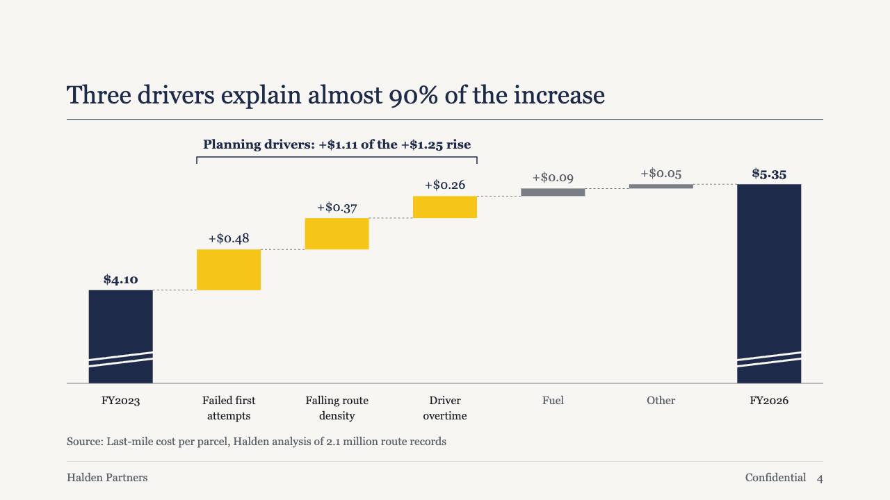
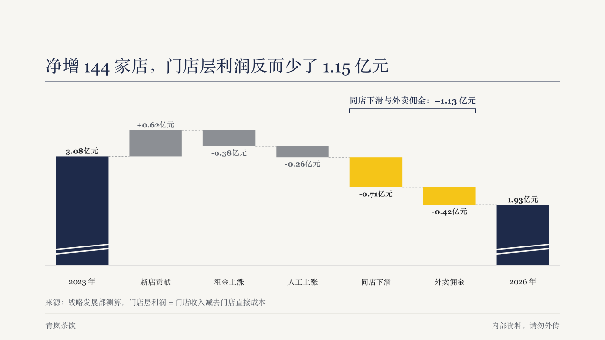

# waterfall

Two changes settled on brief's bridge page, and both reach every theme: marking the bars the page is about, and breaking a tall axis.

Code: [`src/components/waterfall.tsx`](../../../src/components/waterfall.tsx), schema in [`src/ir/components/waterfall.ts`](../../../src/ir/components/waterfall.ts). On brief the page is drawn by the `gauge-exhibit` face, which gives the bridge the whole body band.

## brief, 2026-10

| board (p04) | engine |
| :-: | :-: |
|  |  |

**What it looks like.** With `items[].emphasis` on a run of adjacent bars, those bars take the accent, every total takes primary, and every other bar recedes to one grey with its value printed in muted. A primary bracket spans the marked bars with its ends hooked down, and `emphasis_label` sits over it at 18px bold in primary, in a band kept clear above the plot. When every level of the bridge is positive and the lowest is at least half the highest, the axis starts at a floor instead of zero, and each total bar carries two strokes in the page colour across its foot to show it is cut.

**Why.** The claim is "three drivers explain almost 90% of the increase", so the three drivers should be the only colour on the chart, and the bracket says what they add up to. From $4.10 to $5.35, three quarters of every bar from zero is the same solid block, which leaves the movements a few pixels tall. Starting at a floor gives them the height, and the cut marks keep the reader from comparing totals against zero.

**What it gave up.**

- The marked bars must sit side by side and cannot be totals, so one bracket always covers exactly them. A label needs at least one marked bar.
- The floor is rounded down to a leading digit 0.8 of the levels' span below the lowest level ($4.10 to $5.35 starts at $3.00). A bridge too short to keep the cut marks clear of the bar tops draws from zero.
- The broken axis is on for every theme. A bridge with nothing marked keeps the old colour policy byte for byte.

## almanac, CBAM sample, 2026-10

`items[].note`. Settled on the bridge page (p05): see the board in [compositions/formula](../../compositions/formula/almanac.board.png). The round's decisions are in [rounds/2026-10-05-almanac](../../rounds/2026-10-05-almanac/README.md).

**What it looks like.** A bar's note (「3.187 吨」「0.975 × 1.370 = 1.336 吨」) is a short line under its label, in the muted ink, in mono in the yearbook setting.

**Why.** A bridge of money is worked from a bridge of tonnes, and each bar shows the quantity it was priced from.

**What it gave up.** One line a note, as wide as its bar's column. A longer one is cut and marked.
