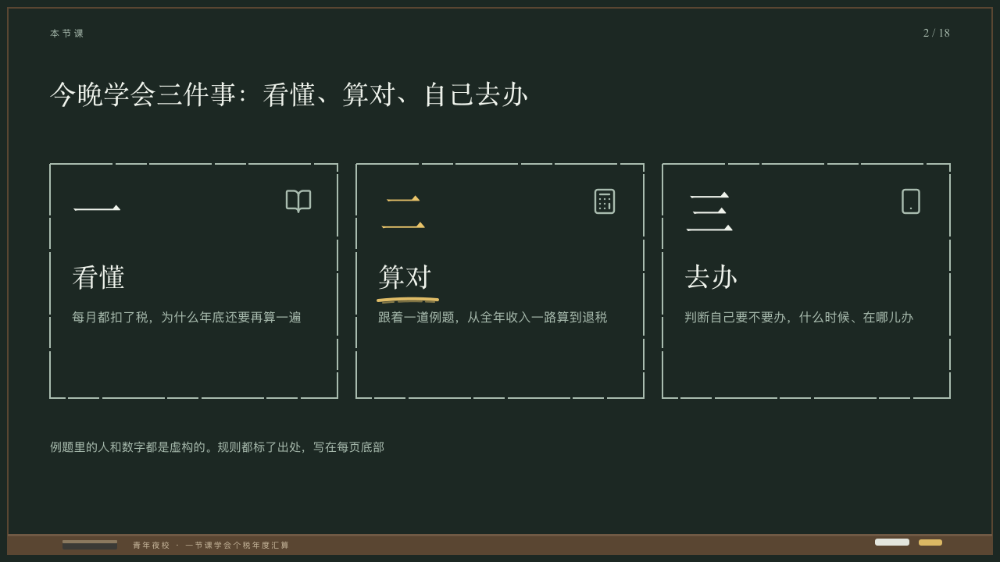

# agenda

What tonight's class covers, in boxes of chalk.

Code: [`src/layouts/compositions/agenda.tsx`](../../../src/layouts/compositions/agenda.tsx). The header comment there is the contract. The chalkboard setting only.

## lecture, annual tax reconciliation evening class sample, 2026-10

Settled on p02. The round's decisions are in [2026-10-08-lecture](../../rounds/2026-10-08-lecture/README.md).

| board (p02) | engine |
| :-: | :-: |
|  |  |

**What it looks like.** Two to four boxes across the measure from y210, 300px tall, 24px apart, their edges drawn in the chalk grey and skipping as chalk does. Each its numeral at 64/80 in the serif (一, 二, 三 on a Chinese board, 1, 2, 3 otherwise), its symbol at 36px in the grey at its top right, its name at 34/46 in the serif from y330 and up to three lines at 16/28 in the grey from y392. The part whose name the author writes wholly `**…**` has its numeral in yellow and one stroke of yellow chalk under its name. A closing line at 15/26 in the grey on y560.

**Why.** The first board of a class says what tonight will teach and in what order, and the part the class spends most time on is the one chalked under.

**What it gave up.**

- Takes an `icon_cards` of two to four items, each an icon, a name and a text, and optionally a `paragraph`. A title over the cards, a tag or a tone goes to the ordinary renderer.
