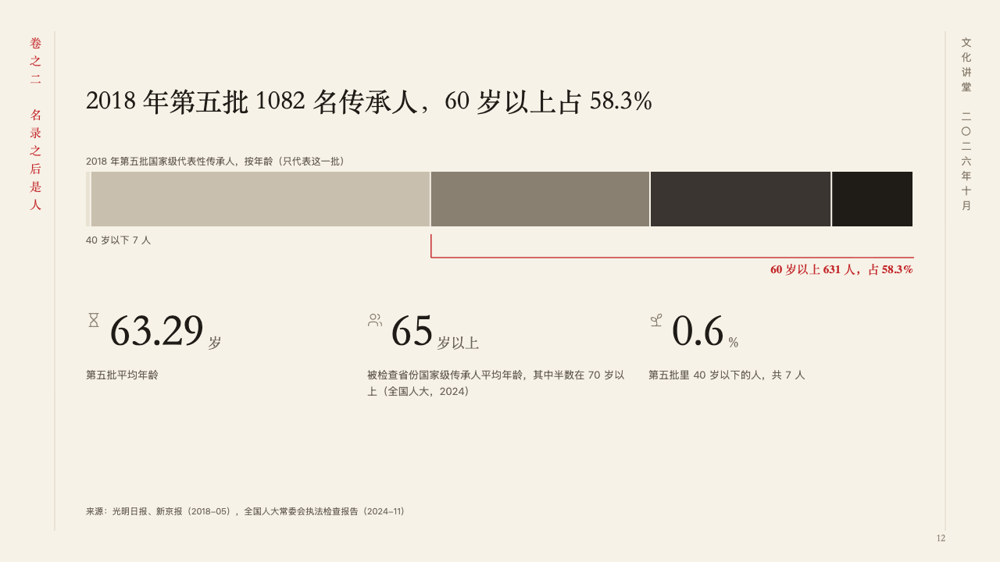
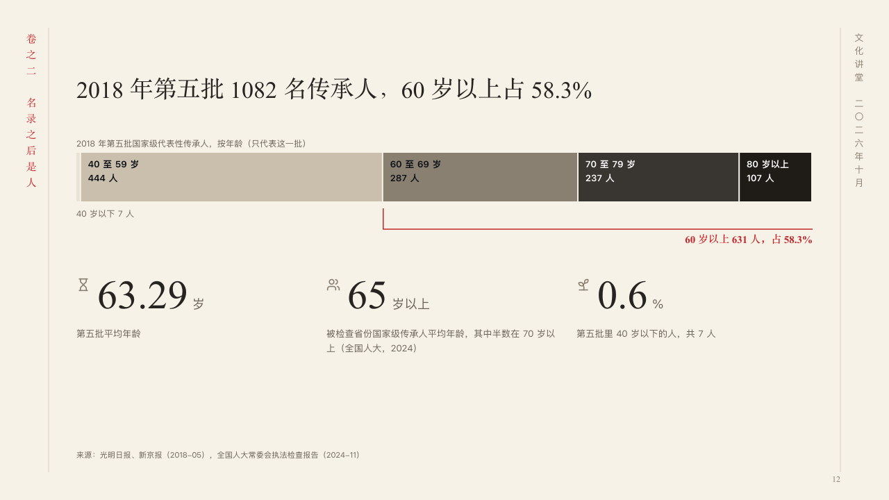

# ages

One whole cut into groups that run from young to old, its run bracketed.

Code: [`src/layouts/compositions/ages.tsx`](../../../src/layouts/compositions/ages.tsx). The header comment there is the contract. The scroll setting only.

## ink, intangible heritage public lecture sample, 2026-10

Settled on p12. The round's decisions are in [2026-10-07-ink](../../rounds/2026-10-07-ink/README.md).

| board (p12) | engine |
| :-: | :-: |
|  |  |

**What it looks like.** The claim over the page. Under it the bar's caption (its one category) in the grey, then the share bar across the measure, its parts a ramp from the palest to burnt ink in the order the author wrote them, each part wide enough named inside it with its count, the parts too narrow for their words named under the bar at the left. The run the author marks (`emphasis` on its series) is bracketed under the bar in cinnabar, and the author's own line for it (`emphasis_label`) stands at the bracket's end. Under the bracket a row of figures, each with its symbol, set large in the heading face, and what it counts in the grey under it.

**Why.** Age reads from young to old, so the parts darken as they age, and the bracket gathers the run the page is about without a legend.

**What it gave up.**

- Takes a share bar (a horizontal `stacked` chart of one category) of three to six series, a run of them marked, with an `emphasis_label`, then a `kpi_cards` of two to four.
- A chart with a title, a tag, a reference or statuses, marked series that are not one run, a card with a tag, a delta, a tone or a source, or a part's words, a figure or a line past its room sends the page back.
