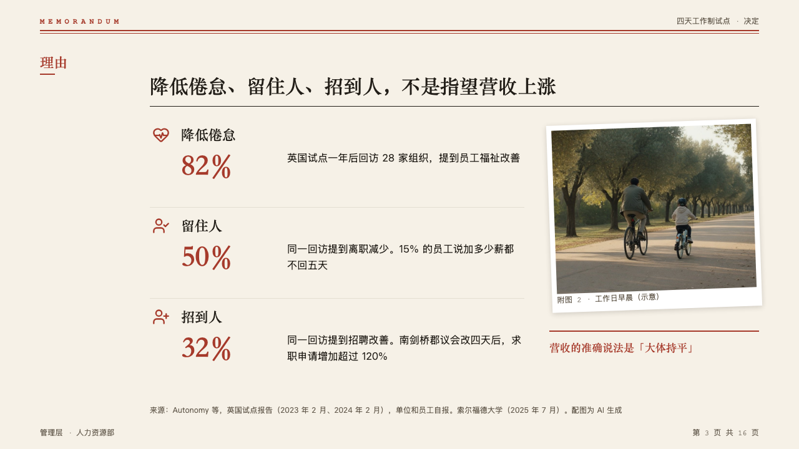
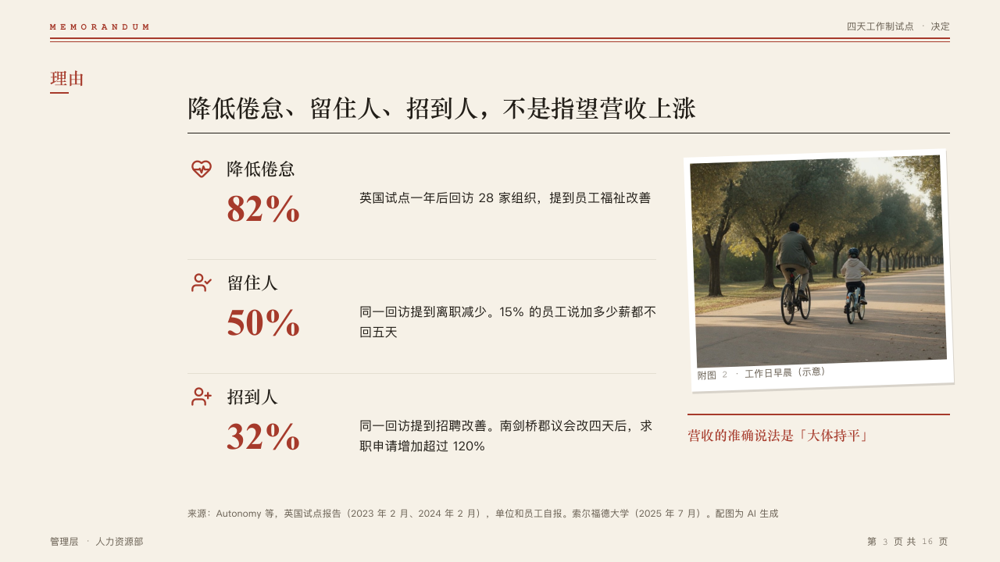
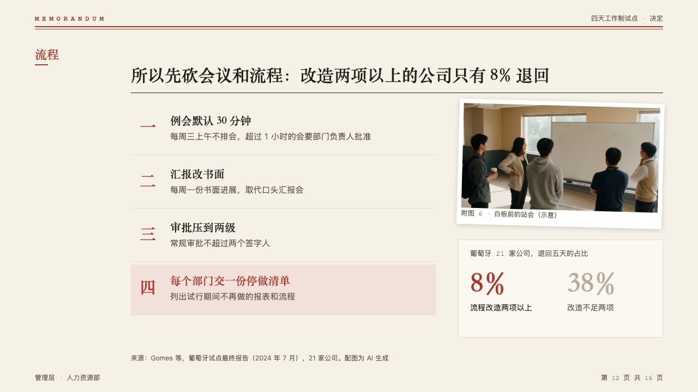
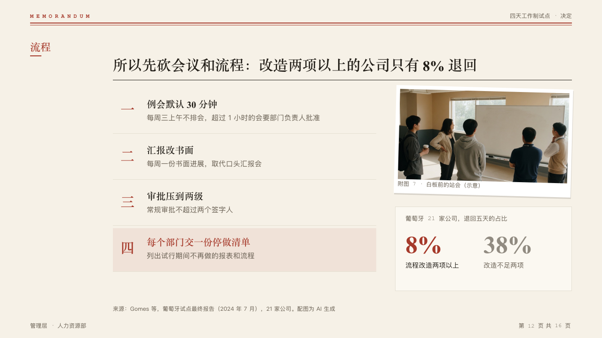

# annex

A page's body beside a column that holds an exhibit: the photograph pasted in at the top of the column, and under it a remark, a few evidence rows or a figures panel.

Code: [`src/layouts/compositions/annex.tsx`](../../../src/layouts/compositions/annex.tsx), with the exhibit in [`exhibit.tsx`](../../../src/layouts/compositions/exhibit.tsx).

## memo, four-day week decision sample, 2026-10

Settled on the reasons page (p03), the coverage page (p10, board in [compositions/rota](../rota/memo.board.png)) and the process page (p12). The round's decisions are in [rounds/2026-10-05-memo](../../rounds/2026-10-05-memo/README.md).

| board (p03) | engine |
| :-: | :-: |
|  |  |

| board (p12) | engine |
| :-: | :-: |
|  |  |

**What it looks like.** The column stands at the right of the band: 336px for a remark, 396px for evidence rows, 376px for a figures panel or nothing. The exhibit fills its width. Under it a remark is bold in the heading face at 17/26 in the mark under a 2px rule of the mark. Evidence rows are 68px apart on hairlines: the icon in the mark, the label bold at 14px, its note in 12px mono, the figure at 30px in the heading face at the right. A figures panel is the paper lifted a step, the note every figure shares typed over them as its label, each figure at 52px in the heading face over its label, the marked one in the mark and the others in the quiet grey. Everything before the picture is drawn left of the column by the other compositions or the component renderer.

**Why.** A memo's reasons point at the attachment that shows them, and the attachment is pasted beside the words, not over them.

**What it gave up.**

- One picture a page, after at least one component. A follower it has no form for, a caption too long for the print, or a body the band cannot hold sends the page back.
