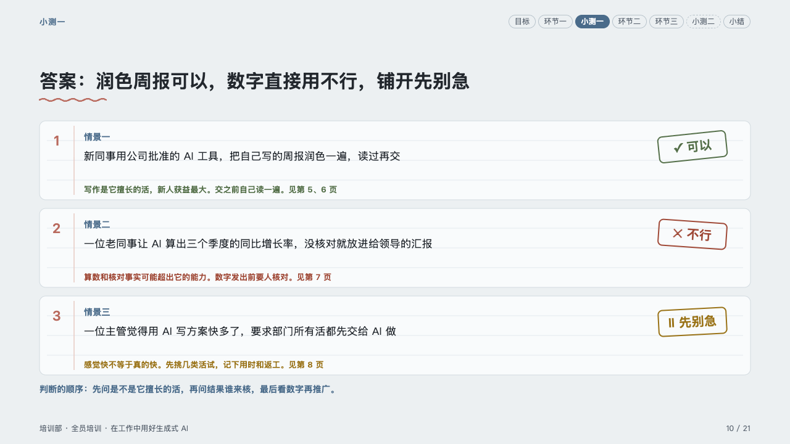
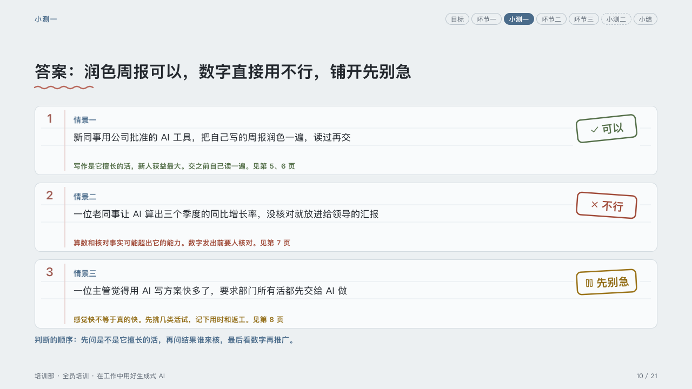
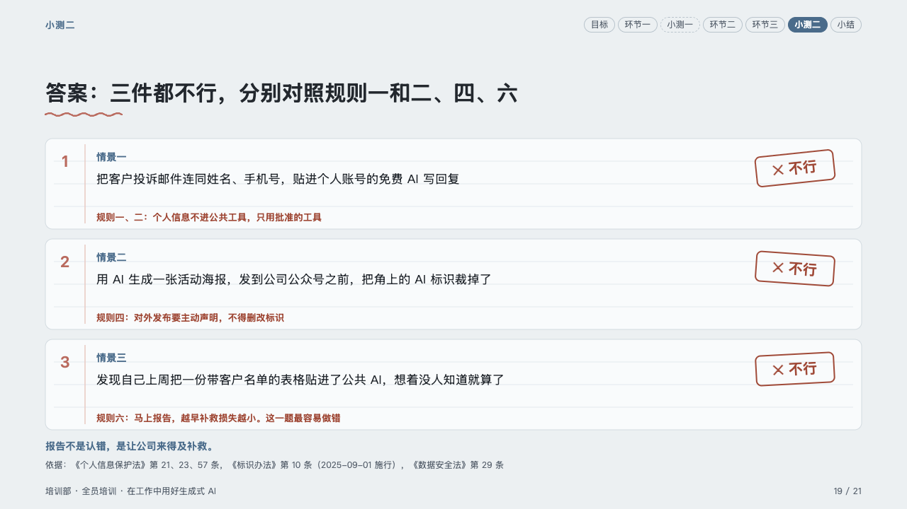
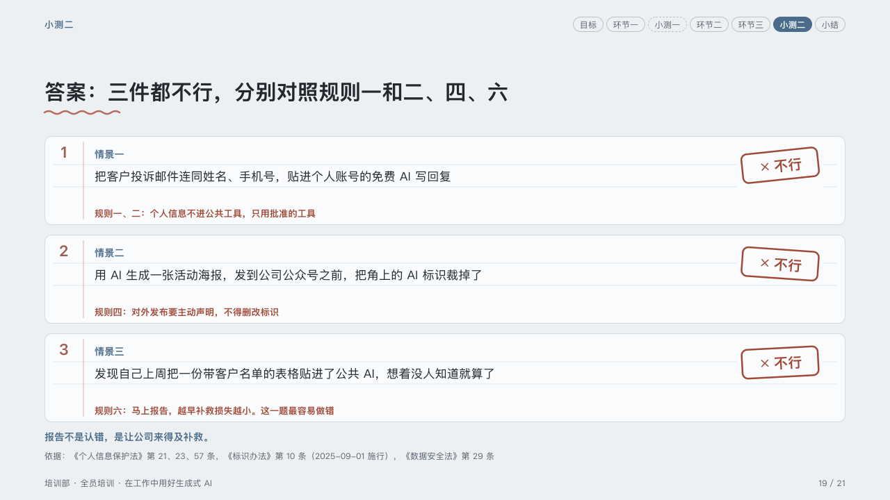

# answers

A quiz's questions marked: a stamp on each, and why.

Code: [`src/layouts/compositions/answers.tsx`](../../../src/layouts/compositions/answers.tsx). The header comment there is the contract. The lesson setting only.

## homeroom, AI-at-work training sample, 2026-10

Settled on the two answer pages (p10, p19). The round's decisions are in [rounds/2026-10-06-homeroom](../../rounds/2026-10-06-homeroom/README.md).

| board (p10) | engine |
| :-: | :-: |
|  |  |

| board (p19) | engine |
| :-: | :-: |
|  |  |

**What it looks like.** Each question on the same ruled card as the quiz, its number in the pen, its case bold in the mark and the case at 17/30, and at its right a stamp turned a few degrees: a tick for yes in the success ink, a cross for no in the danger ink, a pause for not yet in the warning ink (the item's `tone`), with the verdict's word. Under the case, in the stamp's ink, the reason and the page to look back at. Under the cards one line in the mark: the order to judge in.

**Why.** The stamp is the answer the room checks against: the same card, the same place, marked in red, green or amber.

**What it gave up.**

- A `row_cards` of two to four items, each with a title written 「case：verdict」, a text, a sub and a tone, then optionally a `callout` with no icon, title or tag.
- The board's ✓, ✕ and ‖ are lucide icons (check, x, pause): a glyph in a font PowerPoint may lack would not survive the export.
- The rules fall as on the quiz's cards. The one the reason would sit on is left out, and the rules stop 4px short of the stamp.
- The closing line stands at y618, two pixels above the board's, inside the band.
