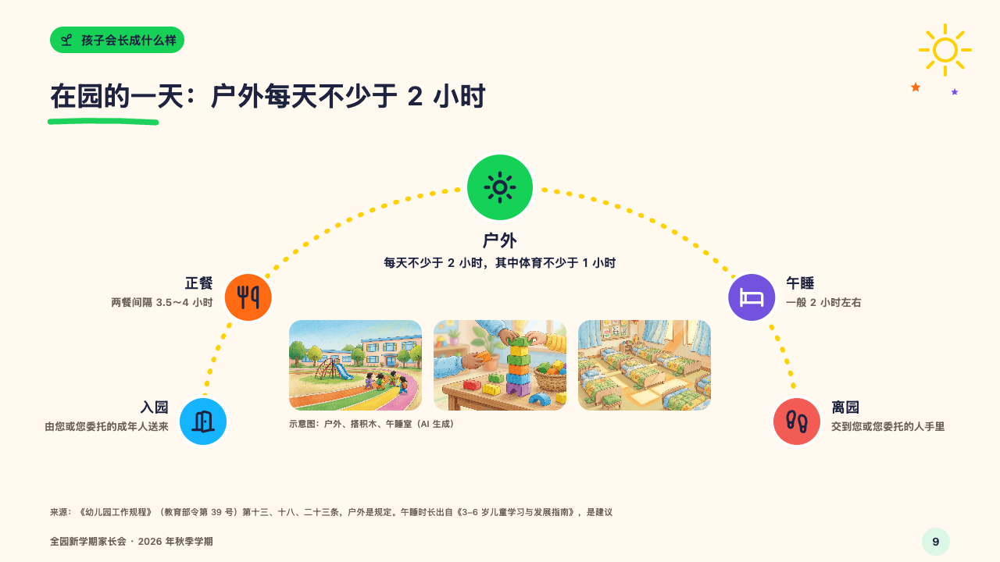
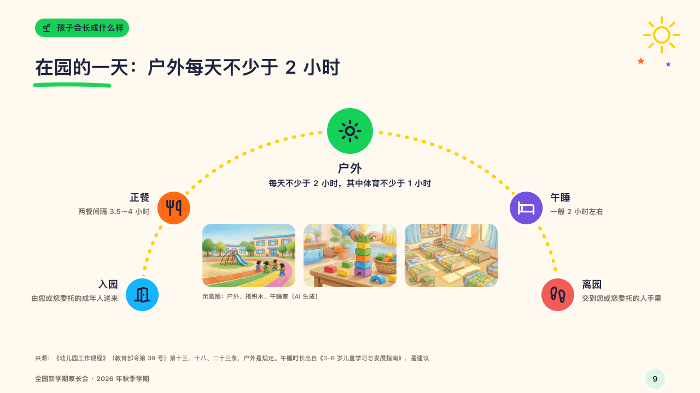

# arc

A day as the sun's path across the sky.

Code: [`src/layouts/compositions/arc.tsx`](../../../src/layouts/compositions/arc.tsx). The header comment there is the contract. The crayonbox setting only.

## crayon, new term parents' meeting sample, 2026-10

Settled on p09. The round's decisions are in [2026-10-08-crayon](../../rounds/2026-10-08-crayon/README.md).

| board (p09) | engine |
| :-: | :-: |
|  |  |

**What it looks like.** A dotted arc in sunny yellow from x260 to x1020, a disc on it at each part of the day with its symbol, the part the page is about (the `highlight`) larger at the top of the arc with its name (22px) and words under it, the parts before it down the left with their words to their left, the parts after it down the right with their words to their right. Inside the arc a row of 170 by 116 photographs. A note on the first photograph alone is the row's note, set under the row. Otherwise each photograph's note is set under it.

**Why.** A child's day runs from the morning to the afternoon, and the sun's path puts the two hours outdoors at its height.

**What it gave up.**

- Takes a horizontal `timeline` of three to seven milestones, every one with a symbol, a name (`date`) and words (`title`), one highlighted, at most three on either side, then an `image_grid` of two to four photographs with no symbols or tags.
- A milestone with a description, a tag, a source, a tone or a status, or a name or words past their room send the page back.
