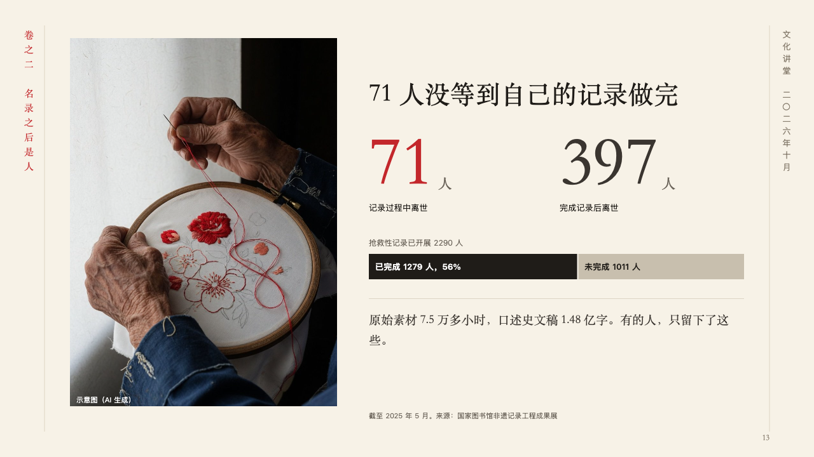
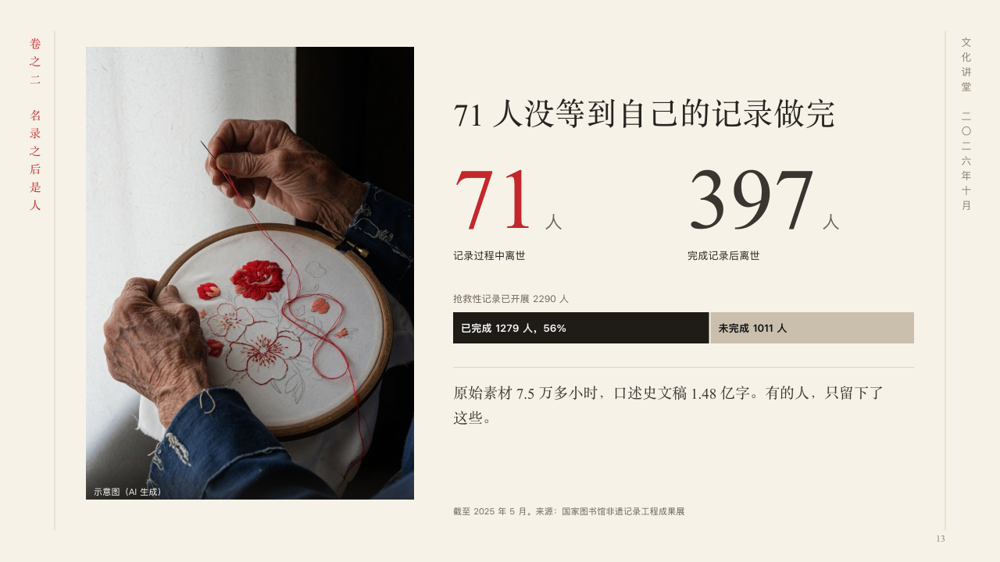

# archive

Two figures and how far a piece of work has gone, beside a photograph.

Code: [`src/layouts/compositions/archive.tsx`](../../../src/layouts/compositions/archive.tsx). The header comment there is the contract. The scroll setting only.

## ink, intangible heritage public lecture sample, 2026-10

Settled on p13. The round's decisions are in [2026-10-07-ink](../../rounds/2026-10-07-ink/README.md).

| board (p13) | engine |
| :-: | :-: |
|  |  |

**What it looks like.** A photograph 420px wide runs the height of the page at the left, its note in white at its foot. Beside it the claim at 40px, then two figures at 110px with their units small after them, the one the author marks (`**…**`) in cinnabar and the other in the second ink, each with what it counts under it. Under them the bar's caption in the grey and a share bar across the column, the part the author marks (`emphasis` on its series) in burnt ink and the rest faint, each part named inside it with its count, the marked part with the author's own line (`emphasis_label`) when there is one. Under a hairline a line in the heading face. The source stands under the column.

**Why.** Two losses and how far the work has gone belong on one page: the figures say who was lost, the bar how much is still to do.

**What it gave up.**

- Takes an `image`, a `kpi_cards` of two, a share bar (a horizontal `stacked` chart of one category) of two or three series with one marked, then optionally a `paragraph`.
- A card with a note, a tag, a delta, a tone, a source or a symbol, a chart with a title, a tag or statuses, a part whose words do not fit inside it, a figure, label or line past its room, or a claim that does not fit beside the photograph sends the page back.
