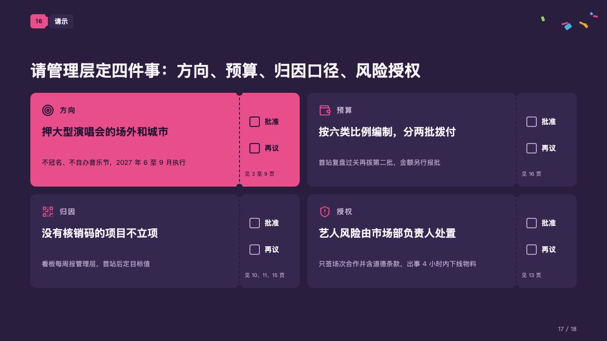
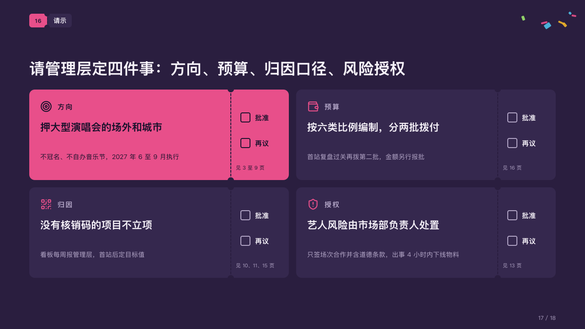

# asks

What a proposal asks the room to decide, each request a ticket with a box for each choice.

Code: [`src/layouts/compositions/asks.tsx`](../../../src/layouts/compositions/asks.tsx). The header comment there is the contract. The marquee setting only.

## rally, summer concert season proposal sample, 2026-10

Settled on the requests page (p17). The round's decisions are in [rounds/2026-10-06-rally](../../rounds/2026-10-06-rally/README.md).

| board (p17) | engine |
| :-: | :-: |
|  |  |

**What it looks like.** Requests two to a row, each a ticket with a perforated stub at its right: on the ticket the request's icon and what it is about in small tracked type, the request itself large, a grey line on what it means; on the stub a box to tick for each choice on the page's ballot (「批准」, 「再议」) and, at its foot, where in the deck it rests (the card's `sub`). The request the page leads with (`emphasis`) is a ticket of the magenta with the dark ink on it.

**Why.** A proposal ends on decisions the room can tick. A box per choice on every request makes the meeting's outcome a mark on the page.

**What it gave up.**

- A card's title is written "about：request" (「方向：押大型演唱会的场外和城市」). The colon is declared on the label's line, not printed.
- On a page with a `ballot` of two choices and no signature: a `numbered_cards` of three or four, titled that way, with icons, at most one marked.
- A label wider than its row, a request past two lines, a line past two lines, a choice wider than the stub or a reference past one line sends the page back.
