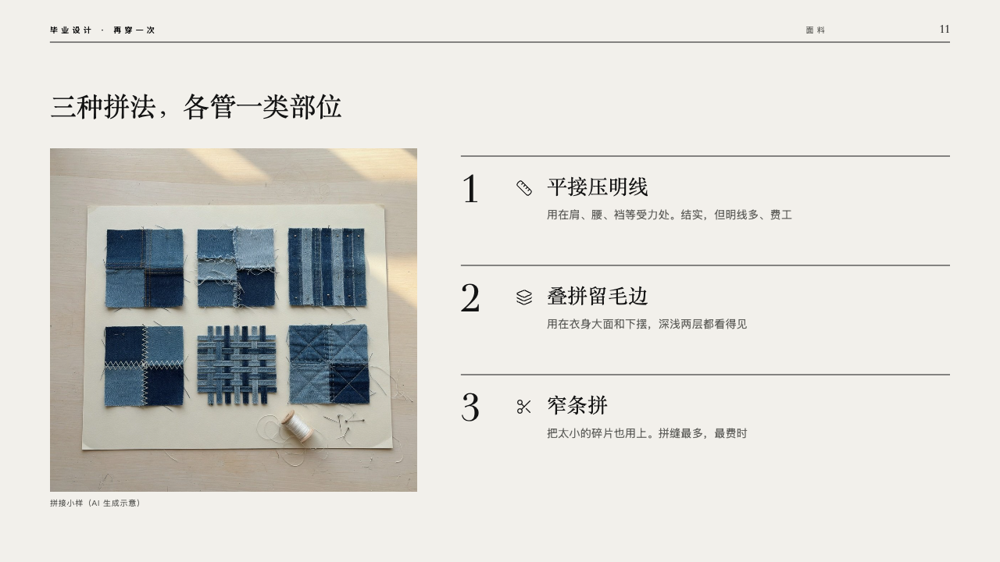
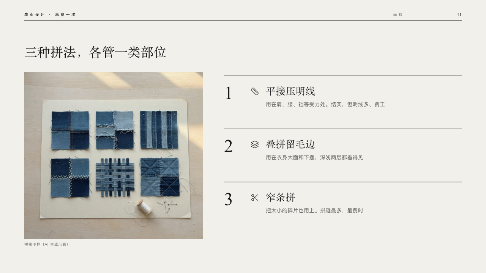

# atelier

A sample laid out large beside the ways it was made.

Code: [`src/layouts/compositions/atelier.tsx`](../../../src/layouts/compositions/atelier.tsx). The header comment there is the contract. The lineup setting only.

## runway, graduation collection review sample, 2026-10

Settled on p11. The round's decisions are in [2026-10-08-runway](../../rounds/2026-10-08-runway/README.md).

| board (p11) | engine |
| :-: | :-: |
|  |  |

**What it looks like.** The claim over the page. The photograph at the left (470 by 440), its caption small and grey under it. At the right a row a way, each under a black rule: its number at 48px in the serif, its symbol, its name at 26px in the serif and what it is for in two lines at 14/22 in the stone grey.

**Why.** Three joins are understood beside the sample that shows them.

**What it gave up.**

- Takes an `image` and a `row_cards` of two to four items, every one with a symbol, a title and words, in either order. The picture's `crop` is kept.
- With four rows each takes one line of words.
- A name past one line or words past their lines sends the page back.
