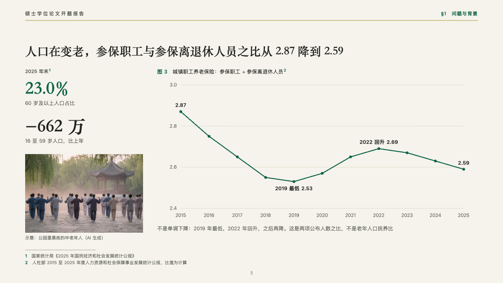
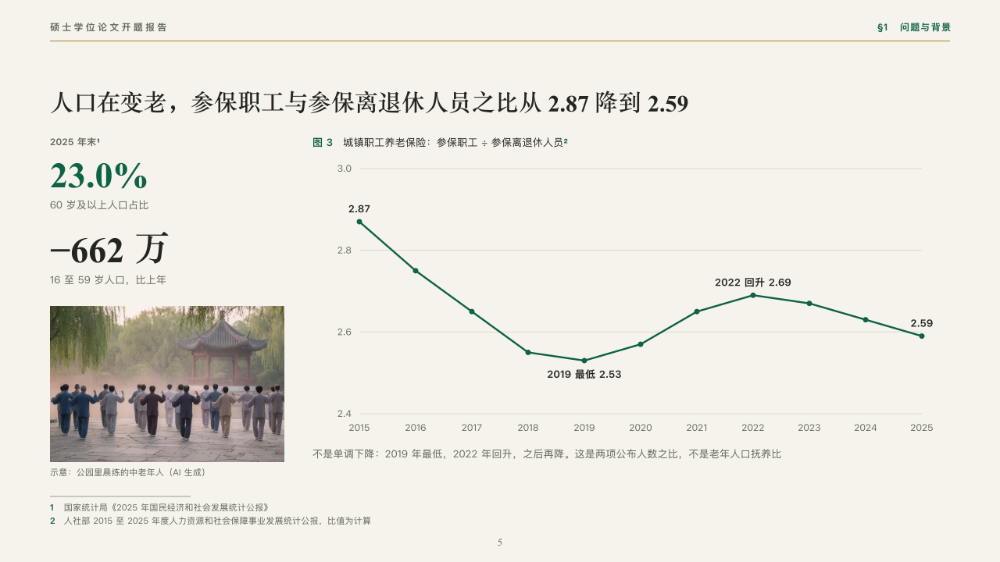

# backdrop

The figures behind a question beside the trend that frames it.

Code: [`src/layouts/compositions/backdrop.tsx`](../../../src/layouts/compositions/backdrop.tsx). The header comment there is the contract. The manuscript setting only.

## thesis, retirement age thesis proposal sample, 2026-10

Settled on the why-it-matters page (p05). The round's decisions are in [rounds/2026-10-06-thesis](../../rounds/2026-10-06-thesis/README.md).

| board (p05) | engine |
| :-: | :-: |
|  |  |

**What it looks like.** Down the left two figures set large in the heading serif, the marked one in emerald, each with its label under it and the first under a small header (「2025 年末」), then a photograph with its plain caption. At the right the figure's number and title, a line in emerald with its points dotted over a few hairlines, its first and last values and each noted point (「2019 最低 2.53」) printed beside it, and a line of reading under the plot.

**Why.** An ageing population and a falling ratio of contributors to retirees are why the reform exists. The line shows the ratio did not fall straight, which the reading spells out.

**What it gave up.**

- Takes a `kpi_cards` of two, an `image`, a titled `line` chart of one series of three to fifteen points and a `paragraph`, in that order.
- A figure, a label, a caption or the reading past one line sends the page back.
