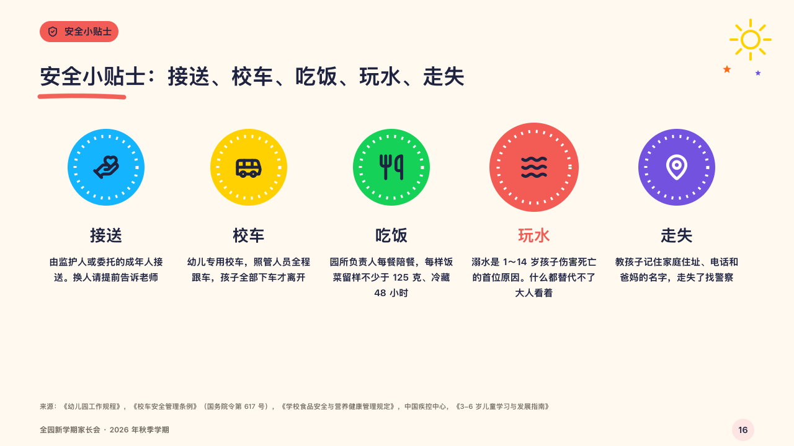

# badges

A few safety reminders as round badges.

Code: [`src/layouts/compositions/badges.tsx`](../../../src/layouts/compositions/badges.tsx). The header comment there is the contract. The crayonbox setting only.

## crayon, new term parents' meeting sample, 2026-10

Settled on p16. The round's decisions are in [2026-10-08-crayon](../../rounds/2026-10-08-crayon/README.md).

| board (p16) | engine |
| :-: | :-: |
|  |  |

**What it looks like.** A disc of crayon a reminder (radius 62), a dashed white ring inside its edge and its symbol (44px) in the middle, its name under it (26px) and what to do under that (15/25, five lines), centred. The one reminder that warns of danger (a card's `tone: "danger"`) takes a larger disc (radius 72) and its name in red.

**Why.** Safety reminders are badges a child might pin on, and the one about water is the one that cannot be missed.

**What it gave up.**

- Takes an untitled `icon_cards` of three to six, every card with a symbol, at most one with the danger tone.
- A card with a tag or another tone, a name past one line or words past five lines send the page back.
