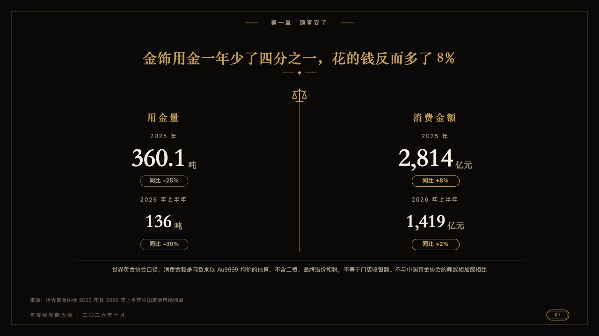
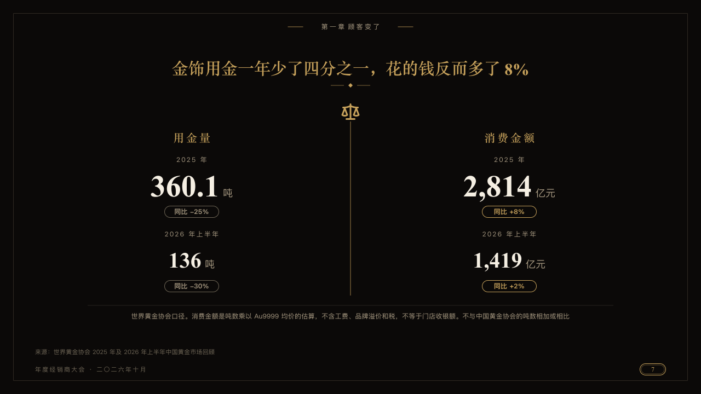

# balance

Two quantities weighed against each other either side of a balance.

Code: [`src/layouts/compositions/balance.tsx`](../../../src/layouts/compositions/balance.tsx). The header comment there is the contract. The invitation setting only.

## luxe, gold dealer conference sample, 2026-10

Settled on p07. The round's decisions are in [2026-10-08-luxe](../../rounds/2026-10-08-luxe/README.md).

| board (p07) | engine |
| :-: | :-: |
|  |  |

**What it looks like.** A gold hairline down the middle with a balance at its head. Each side named in the gold serif by its figures' `tag`. Under the name each period small and tracked, its figure in the ivory serif (the first larger) with its unit in old gold, and its change in a capsule, outlined and lettered in gold when it went up, outlined dim when it went down. Under a hairline across the page the basis both sides rest on, small and centred.

**Why.** Less gold and more money is one sentence with two sides. The balance says they are weighed against each other.

**What it gave up.**

- Takes a `kpi_cards` of four figures, the first two sharing one tag and the last two another, each with its period, its change and its direction, then optionally a `callout` of words alone.
- Tags that do not pair the figures two and two, or a figure, period or change past its room, sends the page back.
