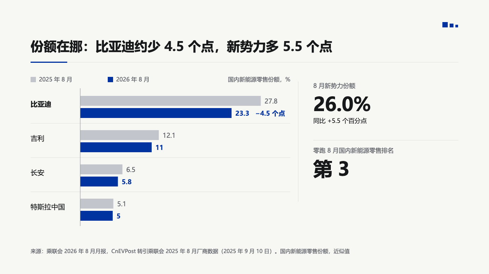

# bars

A horizontal grouped bar chart set by hand: one row per category, one bar per series, every value at its bar's end, and a change written after the bar it lands on.

Code: [`src/layouts/compositions/bars.tsx`](../../../src/layouts/compositions/bars.tsx). The header comment there is the contract.

## bulletin, NEV sample, 2026-10

Settled on the share page, beside the figure column of [`rail`](../rail/). The round's decisions are in [rounds/2026-10-03-bulletin](../../rounds/2026-10-03-bulletin/README.md).

| board (p06) | engine |
| :-: | :-: |
|  |  |

**What it looks like.** The legend sits top left and the unit or axis title top right, both at 16px. Each row is the category name at 18px on the left, then the series' bars 26px thick with 6px between them and the value 10px past each bar's end at 17px, and a hairline between rows. The bars start at an axis line just right of the longest name. The marked series is primary and the rest a receded grey. A change at one category (`changes[].at`) is written in primary bold after the later bar's value, and that category's name turns bold.

**Why.** Company names read best on the left of a row, and a share is compared bar to bar, not against a scale. The change is the page's point, so it sits on the bar it is about.

**What it gave up.**

- One to three series over two to six categories, values zero or more, names within 220px at 18px.
- Every change names its category (`at`). A bracket between two rows has no room on this chart, and validate says so.
