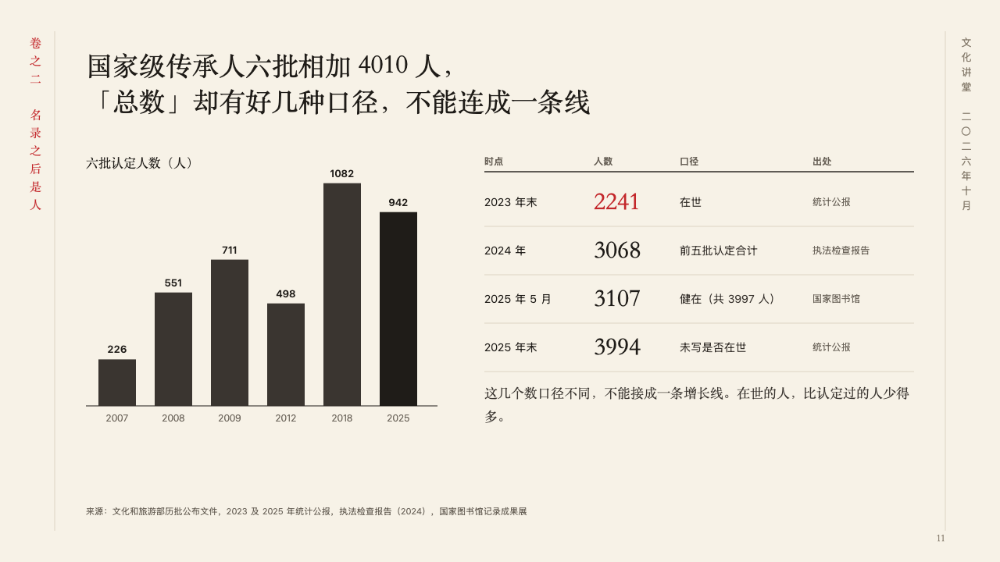
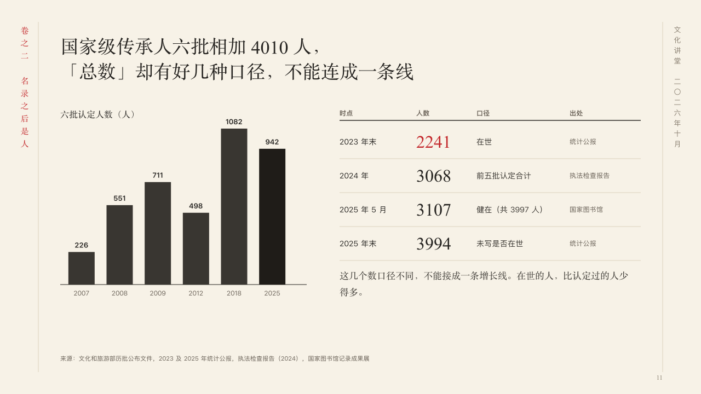

# bases

Counts made one at a time, beside the totals that must not be joined into a line.

Code: [`src/layouts/compositions/bases.tsx`](../../../src/layouts/compositions/bases.tsx). The header comment there is the contract. The scroll setting only.

## ink, intangible heritage public lecture sample, 2026-10

Settled on p11. The round's decisions are in [2026-10-07-ink](../../rounds/2026-10-07-ink/README.md).

| board (p11) | engine |
| :-: | :-: |
|  |  |

**What it looks like.** The claim over the page, in two lines where the author broke it. At the left the counts as upright bars under the chart's title in the heading face, each with its figure over it and its year under it, the bar the author marks in burnt ink and the rest a step paler. At the right an open table of the totals, each from its own count: a heavy rule under its headings, its figures set large in the heading face, the last of four columns (the source) small and grey, hairlines between rows, and the figure in the row the author highlights in cinnabar. Under the table, in the heading face, why they must not be added.

**Why.** The batches add up to one figure and the living bearers to another, and every source counts its own way. Setting the totals as a table beside the bars, never as a line, keeps anyone from joining them.

**What it gave up.**

- Takes a titled upright bar chart of one series of two to eight points at zero or above, a `data_table` of three or four columns, one of them all figures, and two to five rows, then optionally a `paragraph`.
- A chart with a tag, gaps, changes, bands, a reference, notes or statuses, a table with a title, a source, a column's mark or icon, a row's icon or tag, a table with no column of figures, or a cell, heading, title or line past its room sends the page back.
