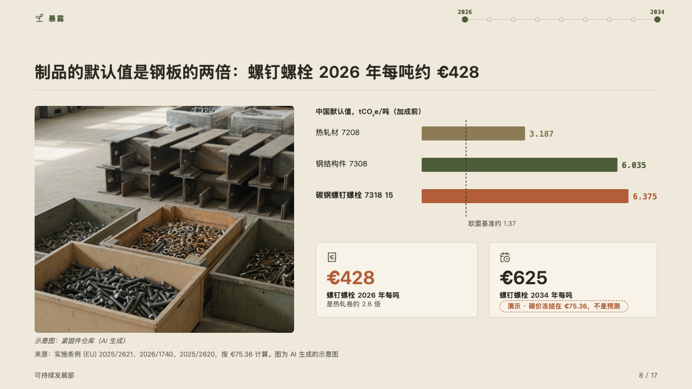
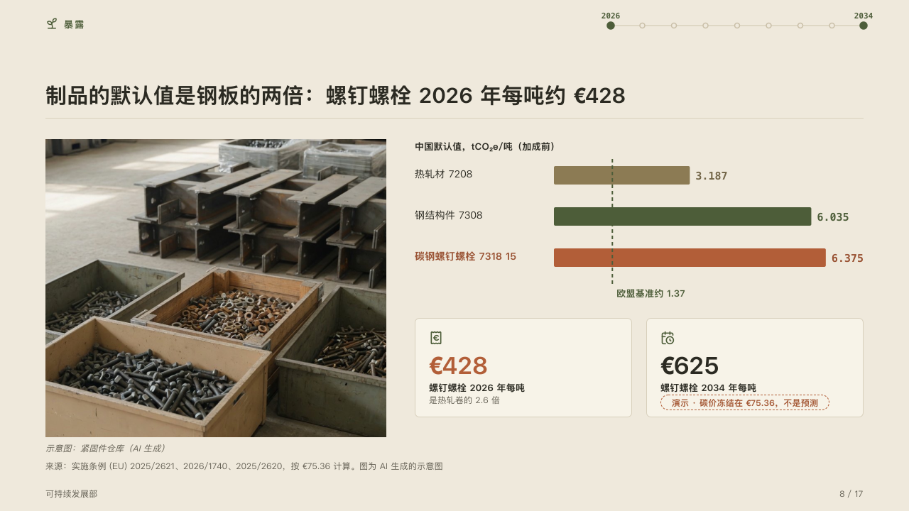
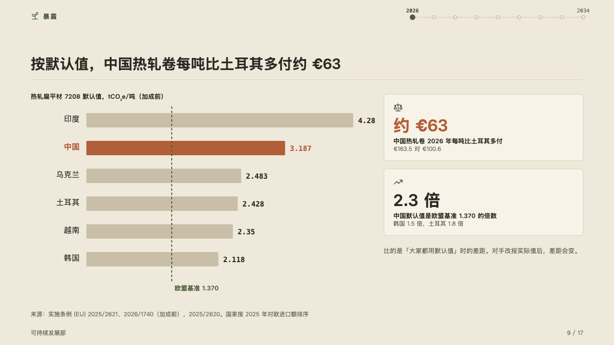
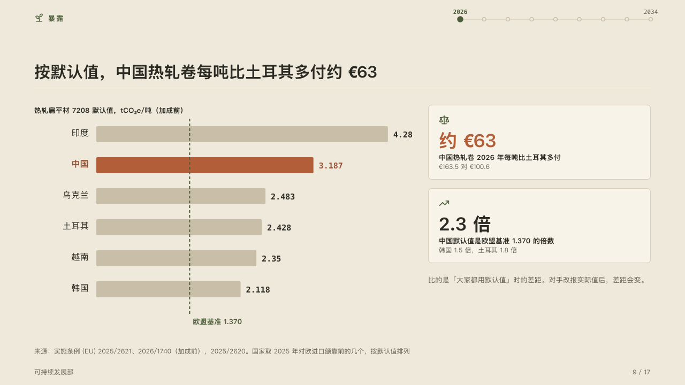

# benchmark

A few figures laid as bars against the one value they are read against.

Code: [`src/layouts/compositions/benchmark.tsx`](../../../src/layouts/compositions/benchmark.tsx). The header comment there is the contract. The yearbook setting only.

## almanac, CBAM sample, 2026-10

Settled on the products page (p08) and the countries page (p09). The round's decisions are in [rounds/2026-10-05-almanac](../../rounds/2026-10-05-almanac/README.md).

| board (p08) | engine |
| :-: | :-: |
|  |  |

| board (p09) | engine |
| :-: | :-: |
|  |  |

**What it looks like.** Each bar a row: its name, the bar, and its value in mono after it. The bar the page is about (`emphasis` on the point), its name and its value are in the accent. A short list of the others steps from the ghost through the quiet ink to the mark, a longer one steps back in the ghost. The chart's `reference` stands across the bars as a dashed line in the mark with its label under it. With a photograph first, the photograph takes the left of the band with its caption in italics under it, and the bars stand over a row of figure cards on the right. Without one, the bars take the left and the cards stand in a column on the right, a quiet note under them.

**Why.** A default value means little on its own. It is read against the EU benchmark that every bar has to cross, so the benchmark is one line through all of them.

**What it gave up.**

- Optionally an `image`, then a `bar` chart on its side of one series of two to eight bars, none below zero and none with a note, then a `kpi_cards` of one to three items, then, without an image, optionally one `callout` with no icon, title or tag.
- A name past its column, a value past the band, cards taller than the band, or a note past its lines sends the page back.
