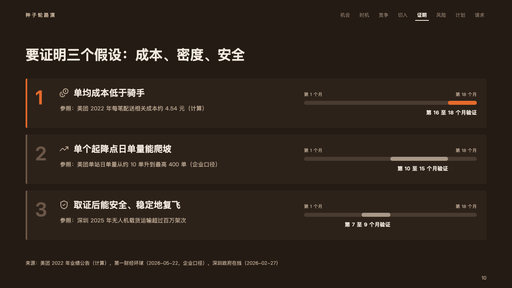
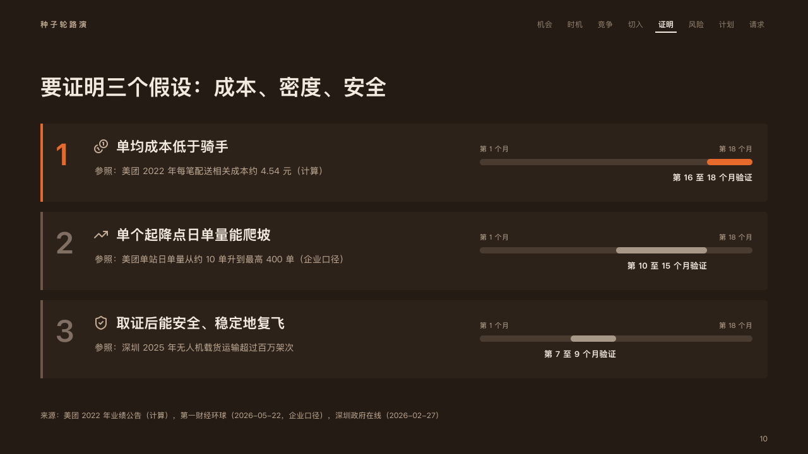

# bets

What a plan has to prove and when: a card a bet, with the window it is proved in laid on the plan's whole stretch.

Code: [`src/layouts/compositions/bets.tsx`](../../../src/layouts/compositions/bets.tsx). The header comment there is the contract. The pitch setting only.

## ember, low-altitude delivery pitch sample, 2026-10

Settled on the hypotheses page (p10). The round's decisions are in [rounds/2026-10-06-ember](../../rounds/2026-10-06-ember/README.md).

| board (p10) | engine |
| :-: | :-: |
|  |  |

**What it looks like.** One card a bet, full width and 124px tall, a 4px edge at its left: its number at 48px, its icon and the claim bold at 22px, and what it is checked against at 14px in the warm grey. At the right, from x760, a window: a dark track 10px tall over the plan's whole stretch (`range`), its two ends named at 11px (「第 1 个月」, 「第 18 个月」), and the stretch the bet is proved in laid on it, named bold under its end (`period`, 「第 16 至 18 个月验证」). The bet the page leads with (`emphasis`) takes the fire for its edge, its number and its stretch. The others' stretches are in the palette's quietest ink.

**Why.** Hypotheses in a pitch are promises with dates. Laying each on the whole plan shows in one look which comes first and which the round is really paying for.

**What it gave up.**

- A `gantt` of two to four rows with the plan's stretch (`range`), each row with a `period`, at most one marked, and its two ends named (`axis_labels`, two of them).
- A claim past one line, what it is checked against past two lines, an end's name wider than half the window, or a period wider than the window sends the page back.
