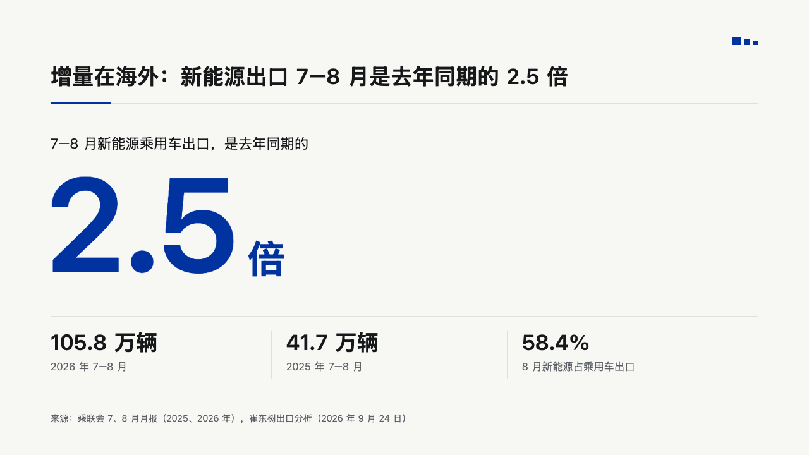
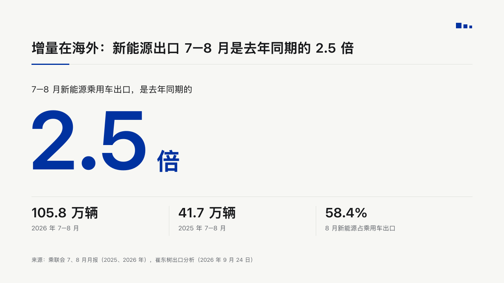
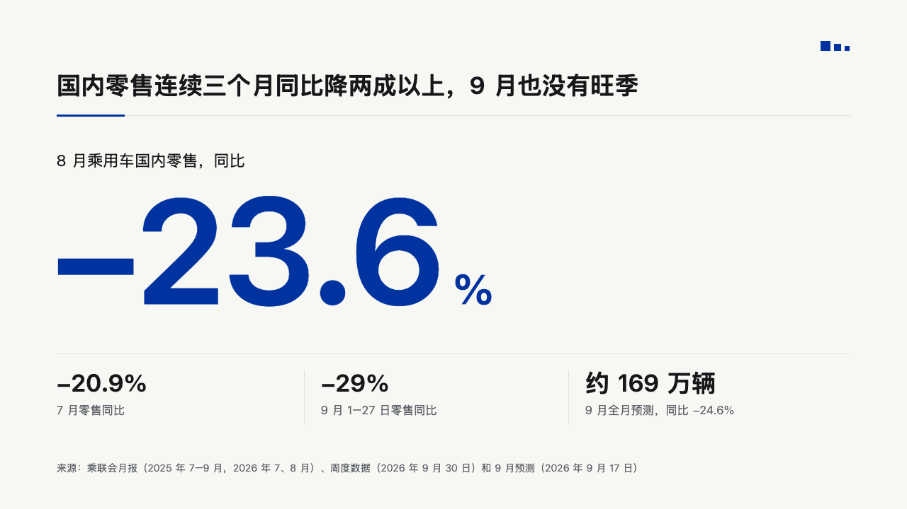
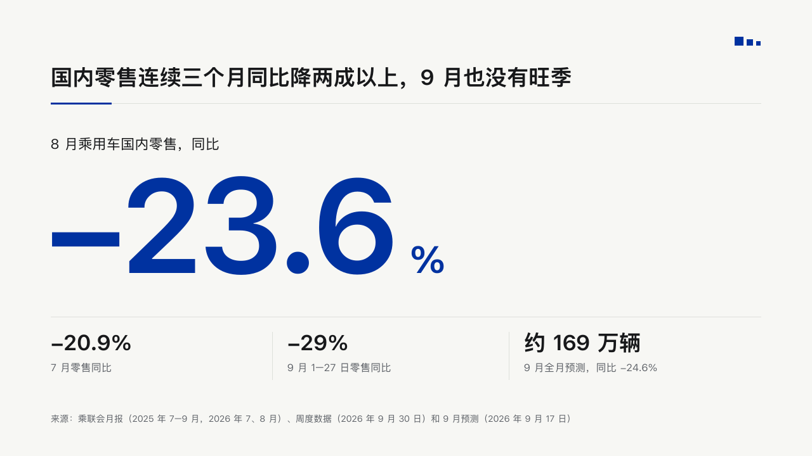
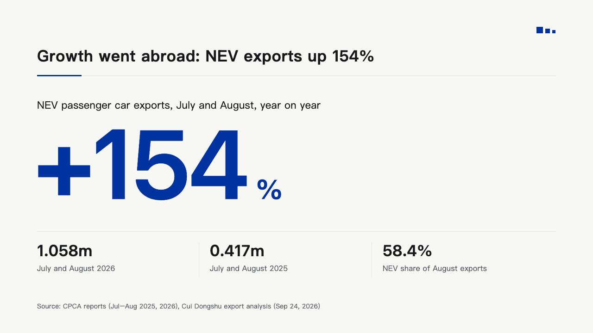
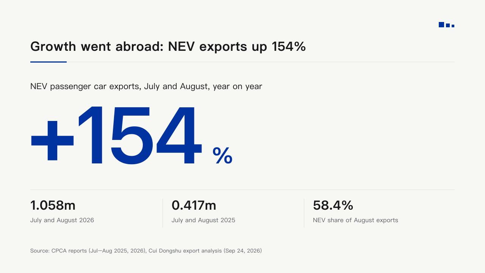

# billboard

One figure as large as the page allows, the line that says what it counts over it, and the figures it is read against under a hairline.

Code: [`src/layouts/compositions/billboard.tsx`](../../../src/layouts/compositions/billboard.tsx). The header comment there is the contract. The notice setting only.

## bulletin, kinds round, 2026-10

Settled on the fact pages p03, p04 and p08. The round's decisions are in [rounds/2026-10-09-bulletin-kinds](../../rounds/2026-10-09-bulletin-kinds/README.md).

| board | engine |
| :-: | :-: |
|  |  |
|  |  |
|  |  |

**What it looks like.** Under the notice header, the first item's label at 22/30 in ink from y212. The figure bold at 210px in IKB from x72, its characters closed up 6px, its baseline on y431, and its unit 18px after it at 60px, a percent sign too. A hairline at y500 from x80 to x1200. Under it the other items in equal columns, each value and unit bold at 34/44 over its label at 16/24 muted, a hairline between columns 24px before each.

**Why.** The number is the news. At 210px nothing else on the page competes with it, and the row under the hairline says whether it is large.

**What it gave up.**

- One `kpi_cards` of one to four items, each with no note, delta, icon, tag, tone or source. Anything else goes to the notice sheet.
- The figure must fit the page at 210px on one line. A label longer than a line goes to the notice sheet.
