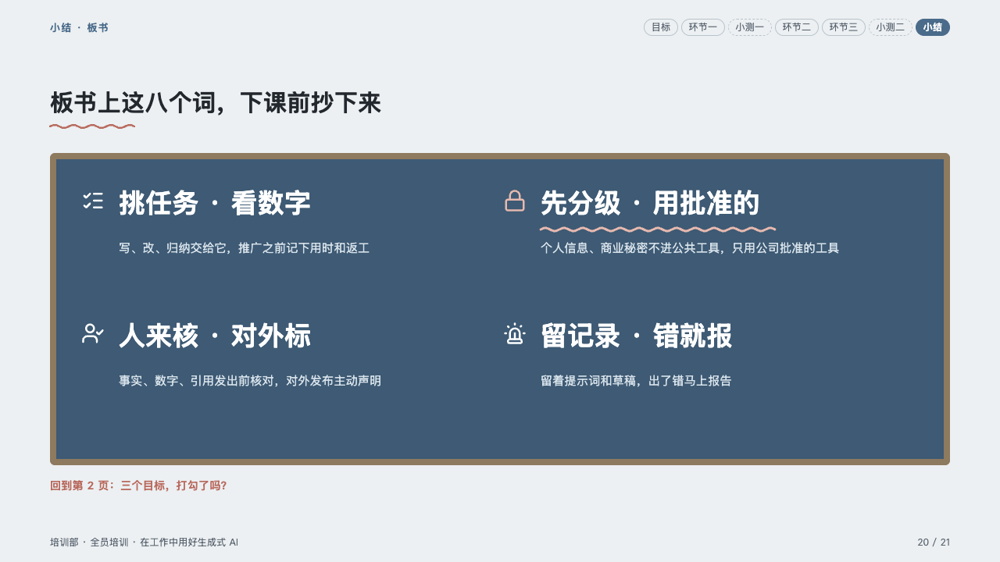
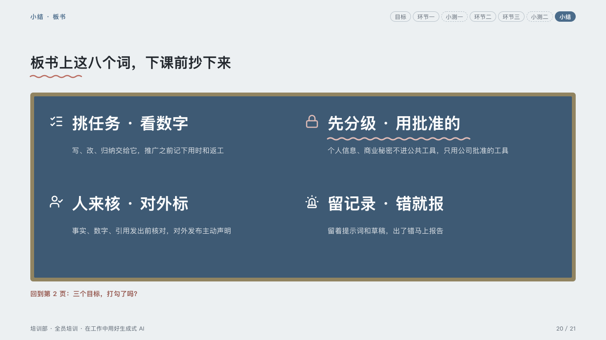

# blackboard

What to copy down before the class ends, written on the board.

Code: [`src/layouts/compositions/blackboard.tsx`](../../../src/layouts/compositions/blackboard.tsx). The header comment there is the contract. The lesson setting only.

## homeroom, AI-at-work training sample, 2026-10

Settled on the recap page (p20). The round's decisions are in [rounds/2026-10-06-homeroom](../../rounds/2026-10-06-homeroom/README.md).

| board (p20) | engine |
| :-: | :-: |
|  |  |

**What it looks like.** The board fills the band inside an 8px frame of wood: two to four items, two to a row, each its icon in white, its words bold at 34px in white and a line or two under them in pale chalk. The item the author marks (`highlight`) is underlined with a wavy line of the pen in chalk, its icon in that ink too. Under the board, in the pen, the line that sends the room back to its goals.

**Why.** A recap is what the teacher writes on the board: a few words big enough to copy.

**What it gave up.**

- A `row_cards` of two to four items with an icon and a text, at most one marked, then optionally a `callout` with no icon, title or tag.
- Words past one line at 34px send the page back.
