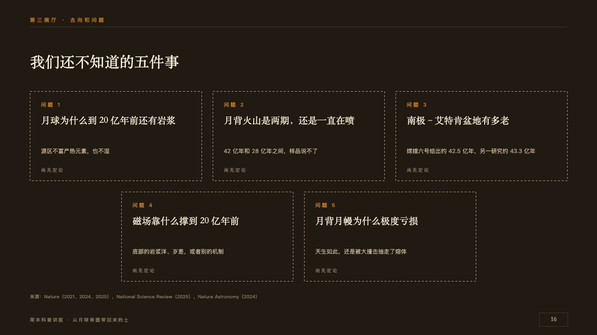
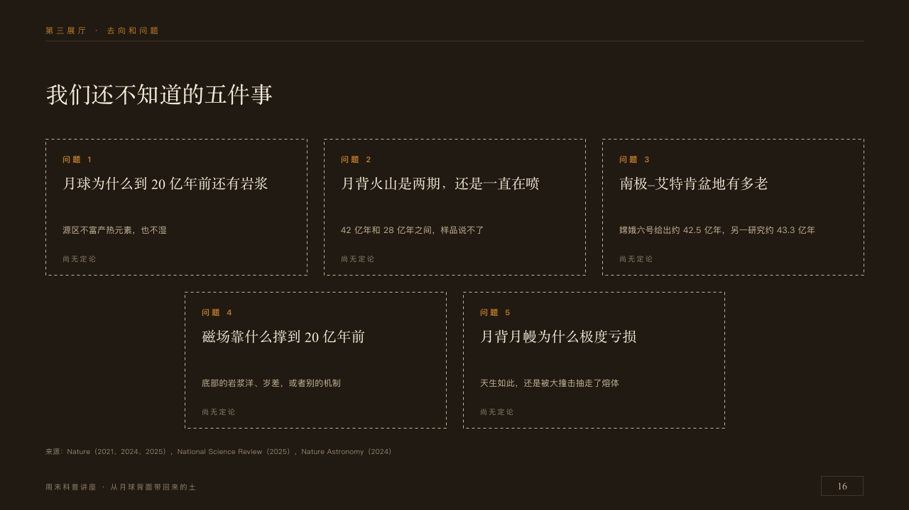

# blanks

The labels still to be written.

Code: [`src/layouts/compositions/blanks.tsx`](../../../src/layouts/compositions/blanks.tsx). The header comment there is the contract. The placard setting only.

## museum, Moon soil science talk sample, 2026-10

Settled on p16. The round's decisions are in [2026-10-08-museum](../../rounds/2026-10-08-museum/README.md).

| board (p16) | engine |
| :-: | :-: |
|  |  |

**What it looks like.** The claim over the page. Each open question on a label of its own, 368 by 192 with a dashed old-paper edge and nothing filled in, three to a row from y196 and the rest centred under them from y412: its number at 11px in copper tracked 3px in the deck's language (「问题 1」, "Question 1"), the question at 20/32 in the serif, what we do know at 12/22 in old paper, and at its foot the verdict every label shares at 10px in the dim tracked 2px.

**Why.** A museum that shows what it does not know shows it as labels nobody has written yet.

**What it gave up.**

- Takes a `numbered_cards` of three to six whose items all carry the same `sub`, none marked and none with an icon. Cards with different `sub`s are not open questions and go elsewhere.
- A line of two lines moves the verdict down.
