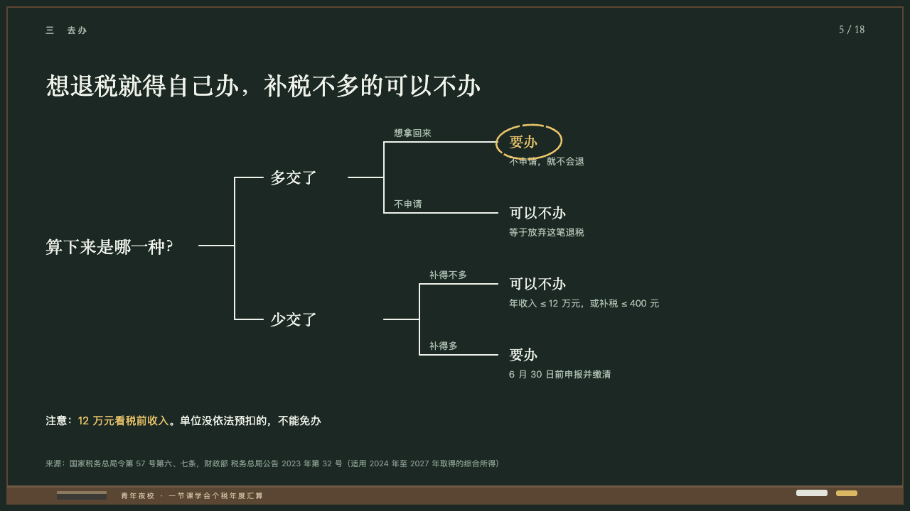
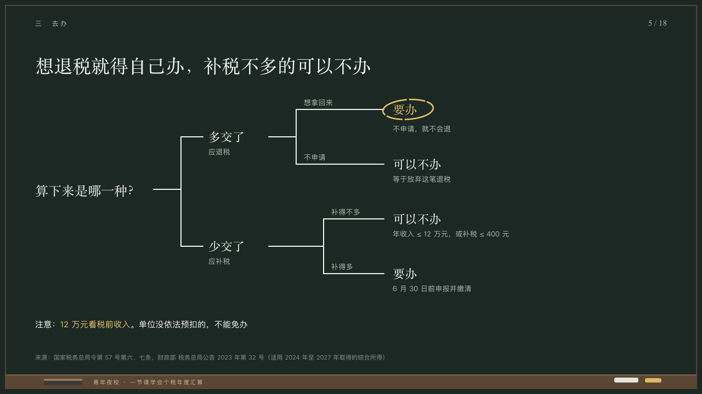

# boughs

A decision branched in chalk.

Code: [`src/layouts/compositions/boughs.tsx`](../../../src/layouts/compositions/boughs.tsx). The header comment there is the contract. The chalkboard setting only.

## lecture, annual tax reconciliation evening class sample, 2026-10

Settled on p05. The round's decisions are in [2026-10-08-lecture](../../rounds/2026-10-08-lecture/README.md).

| board (p05) | engine |
| :-: | :-: |
|  |  |

**What it looks like.** The question at 24/34 in the serif at the left, centred on y347. A chalk line to a trunk at x330 that forks to y250 and y450. Each fork ends at its condition (`edge`) at 22/30 in the serif, what that makes you (`title`) at 13px in the grey under it, then forks again 50px up and down: a chalk line on to x700 with the condition small over it in the grey and, at x716, the answer at 22/30 in the serif with what it means at 13px under it. The recommended answer is in yellow inside a ring of yellow chalk tipped 4 degrees back. A closing line at 15/26 in chalk white on y580, its marked words in yellow.

**Why.** The teacher draws the choice the way it is made: which way did your sums come out, then what do you want.

**What it gave up.**

- Takes a `decision_tree` of two branches of two outcomes each and optionally a `paragraph`. A branch's `title` is drawn small under its condition, which the board left off.
- The second fork stands 50px further right than the first, as the board drew it.
