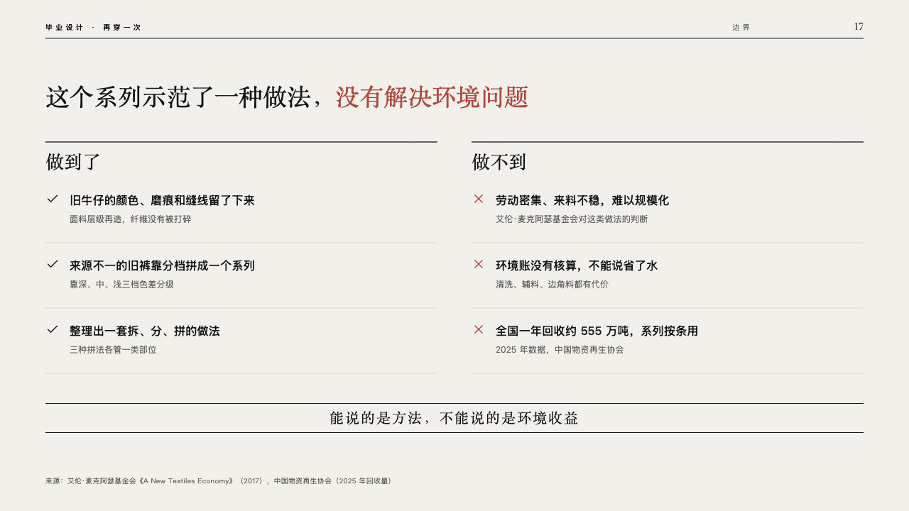
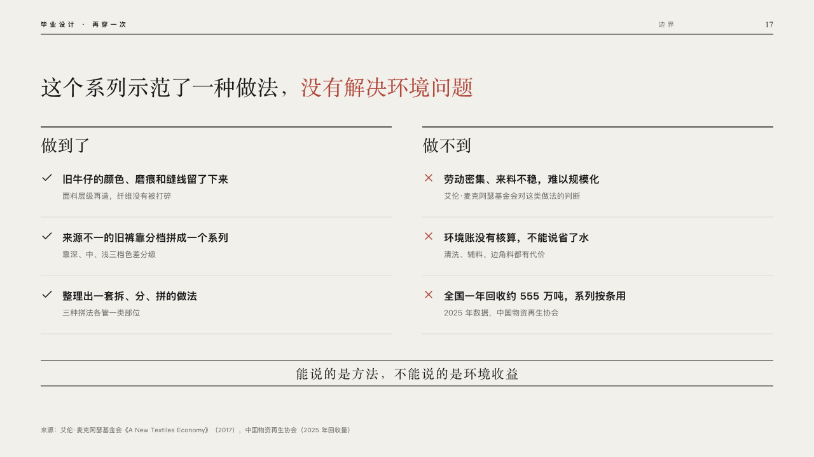

# bounds

What a piece of work did and did not do, stated before anyone asks.

Code: [`src/layouts/compositions/bounds.tsx`](../../../src/layouts/compositions/bounds.tsx). The header comment there is the contract. The lineup setting only.

## runway, graduation collection review sample, 2026-10

Settled on p17. The round's decisions are in [2026-10-08-runway](../../rounds/2026-10-08-runway/README.md).

| board (p17) | engine |
| :-: | :-: |
|  |  |

**What it looks like.** The claim over the page, its marked words in crimson. Two columns, each under a black rule with its name at 26px in the serif: a point a row, a tick in the ink for what was done and a cross in crimson for what was not, the point at 16px in bold, the line on it at 12px in the stone grey under it, a hairline under each row. Across the foot the verdict at 20px in the serif, centred and tracked, between two black rules.

**Why.** A review that names its own limits is more convincing than one that waits to be asked.

**What it gave up.**

- Takes a `pros_cons` of two to four points a side.
- A side's name, a point or its note past one line, or a verdict wider than the page, sends the page back.
