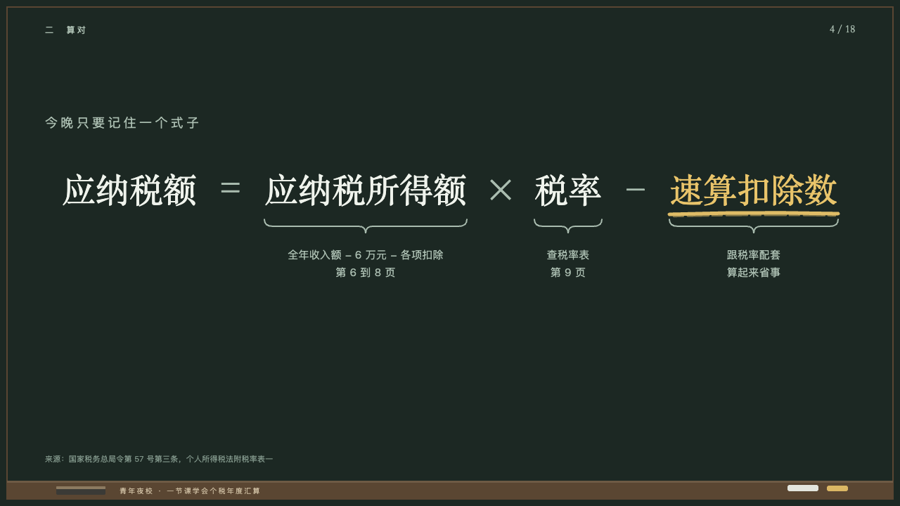
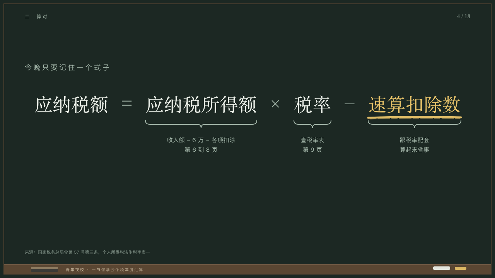

# braces

One formula with a brace under each term it explains.

Code: [`src/layouts/compositions/braces.tsx`](../../../src/layouts/compositions/braces.tsx). The header comment there is the contract. The chalkboard setting only.

## lecture, annual tax reconciliation evening class sample, 2026-10

Settled on p04. The round's decisions are in [2026-10-08-lecture](../../rounds/2026-10-08-lecture/README.md).

| board (p04) | engine |
| :-: | :-: |
|  |  |

**What it looks like.** The page's title is the lead-in, 18px in the grey tracked 4px on y160. The formula centred across the measure from y236 in the serif at 48/64, a point smaller at a time down to 36px when it is wide: terms in chalk white, signs in the grey in 48px cells, 24px apart. The term the author marks is yellow with one stroke of yellow chalk under it. Under each term a note names, a brace in the grey from y312, its tip 20px down, and the note centred under it at 15/25 in the grey from y350, the author's breaks kept.

**Why.** The one line the class copies down, with where each part comes from written under it.

**What it gave up.**

- Takes a `paragraph` written as a formula (its terms between `=`, `×`, `÷`, `+` or `−` with a space either side, an equals sign among them) and a `bullets` of one to four notes written `term：note` after a term of the formula.
- The title is set as the lead-in at 18px. A title that is itself the formula does not suit this page: write the formula in the paragraph.
