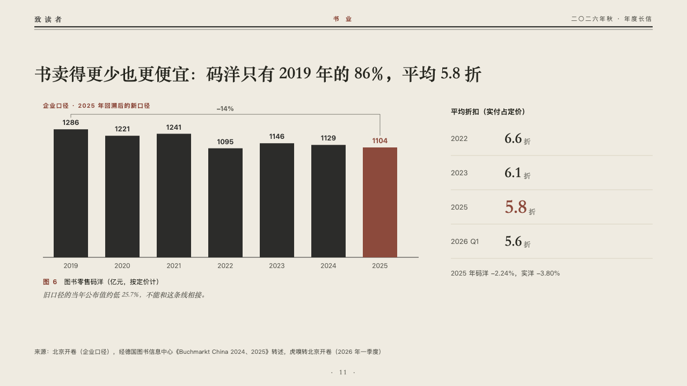

# bracket

A run of bars with its change bracketed, beside a column of figures.

Code: [`src/layouts/compositions/bracket.tsx`](../../../src/layouts/compositions/bracket.tsx). The header comment there is the contract. The periodical setting only.

## journal, annual letter to readers sample, 2026-10

Settled on p11. The round's decisions are in [2026-10-07-journal](../../rounds/2026-10-07-journal/README.md).

| board (p11) | engine |
| :-: | :-: |
|  |  |

**What it looks like.** The claim over the page. Under it the chart's tag in brick red, a bar a year on a baseline of the type's ink, every value over its bar, the marked bar in brick red, and over the run the change the author asked for (`changes`) as a bracket from the first bar to the last with the change computed over it. Under the bars the figure's number and title and the editor's comment. At the right a column: the first figure's tag as its header, a ruled row a figure with its label at the left and the figure large in the heading serif, the marked one larger in brick red, and a note under the column.

**Why.** Sales shrank by a seventh from 2019 and sell for less: the bracket states the first, the column the second. The tag says these are a company's own figures on its restated basis.

**What it gave up.**

- Takes a titled upright bar chart of one series of three to seven values above zero with one change and optionally a tag, optionally a `callout` with words alone, and a `kpi_cards` of two to four with a tag on the first and no symbol, note, source or direction, optionally followed by a `paragraph`. Either the chart or the column may come first.
- Ranges, gaps, a reference or statuses leave the chart to the ordinary renderer.
