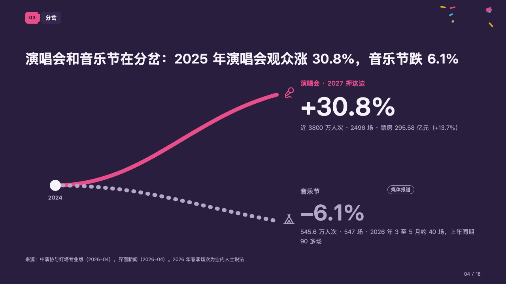
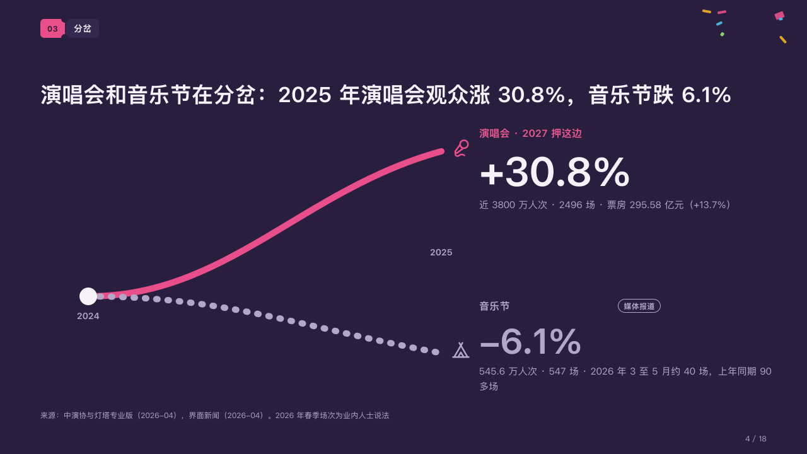

# branch

Two things that started level and went separate ways.

Code: [`src/layouts/compositions/branch.tsx`](../../../src/layouts/compositions/branch.tsx). The header comment there is the contract. The marquee setting only.

## rally, summer concert season proposal sample, 2026-10

Settled on the split page (p04). The round's decisions are in [rounds/2026-10-06-rally](../../rounds/2026-10-06-rally/README.md).

| board (p04) | engine |
| :-: | :-: |
|  |  |

**What it looks like.** From one white dot at the left, named by the year they started from, two curves 10px wide part: the marked series climbs solid in the magenta to the top right, the other falls dotted in the grey to the bottom right, and the year they reach stands small between the two ends. At each end its icon, and beside it a column: the series' line in bold (in the magenta for the marked one), its change set large (64px for the higher, 56px for the lower) and a grey line of what lies behind it, with a tag of where it comes from when it has one (「媒体报道」).

**Why.** The page's claim is a direction, not a value. Two curves from one point show the parting at a glance, and the figures beside their ends say how far.

**What it gave up.**

- The curves are a sketch of the two directions, not a plot: they part the same way whatever the figures.
- A `line` chart of two series over the same two categories, both starting at one value and ending apart, one marked, its unit in `axes.y_unit`; then two `callout`s, one a series, each titled starting with its series' name (「演唱会 · 2027 押这边」).
- A title past one line, a change wider than its column at 64px, a line past two lines, or a tag that does not fit beside its title sends the page back.
