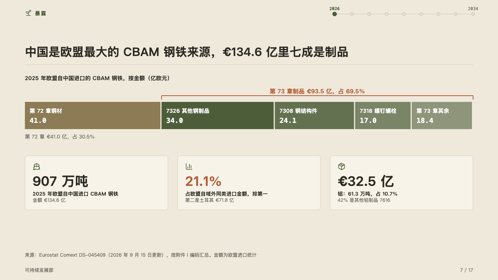
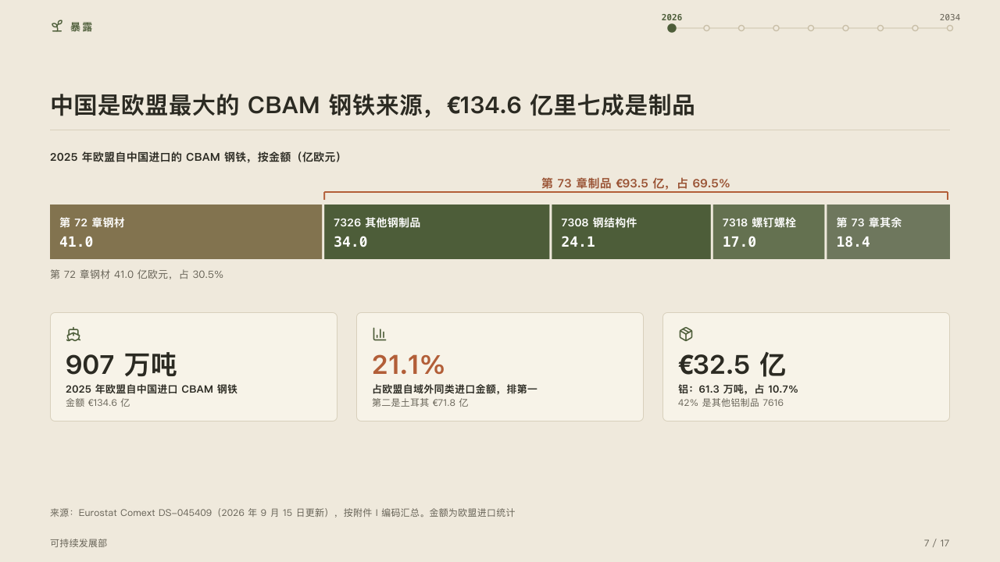

# breakdown

One amount cut into its parts, the parts the page is about bracketed together.

Code: [`src/layouts/compositions/breakdown.tsx`](../../../src/layouts/compositions/breakdown.tsx). The header comment there is the contract. The yearbook setting only.

## almanac, CBAM sample, 2026-10

Settled on the exposure page (p07). The round's decisions are in [rounds/2026-10-05-almanac](../../rounds/2026-10-05-almanac/README.md).

| board (p07) | engine |
| :-: | :-: |
|  |  |

**What it looks like.** The whole's name in bold over a bar across the band, its unit after it. Each part is a block its share of the width, its name and its amount in mono inside it: the parts the page does not mark in the quiet ink and the inks after it, the marked run in the mark stepping paler part by part. Over the marked run a bracket in the accent and over the bracket the run's own line (`emphasis_label`, 「第 73 章制品 €93.5 亿，占 69.5%」). Under the bar the largest unmarked part's amount and share in the muted ink. Under that a row of figure cards.

**Why.** The exposure is not the whole steel trade but the run of downstream goods inside it, so the run is bracketed and named in the author's own words rather than in a total the engine adds up.

**What it gave up.**

- A share bar (a `stacked` chart on its side with one category) of two to six parts whose marked parts stand together, with an `emphasis_label`. Then a `kpi_cards` of one to four items.
- A part too narrow for its name and amount, a line wider than the band, or cards taller than the band sends the page back.
