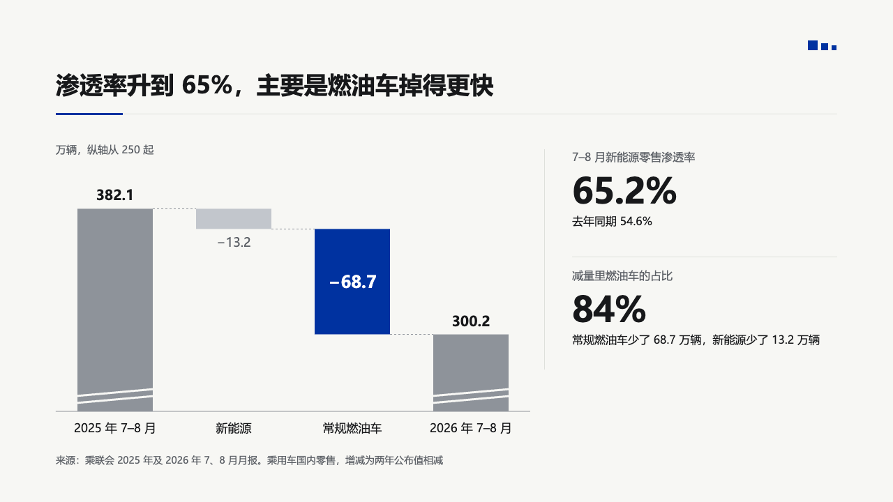
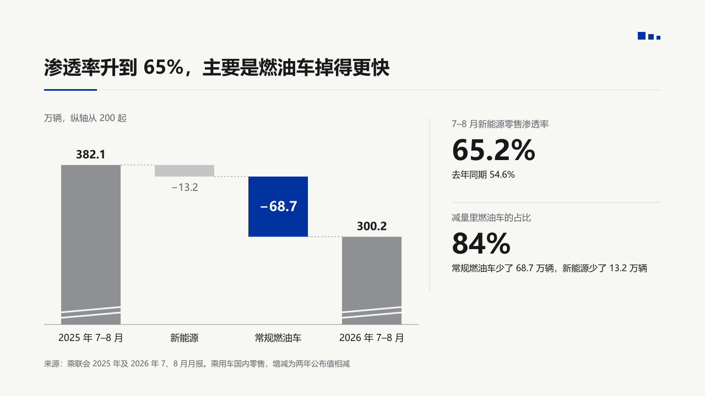
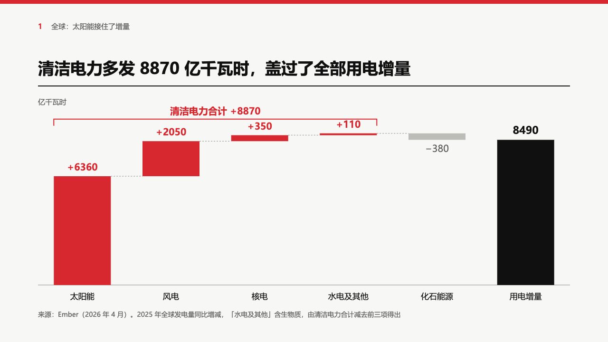
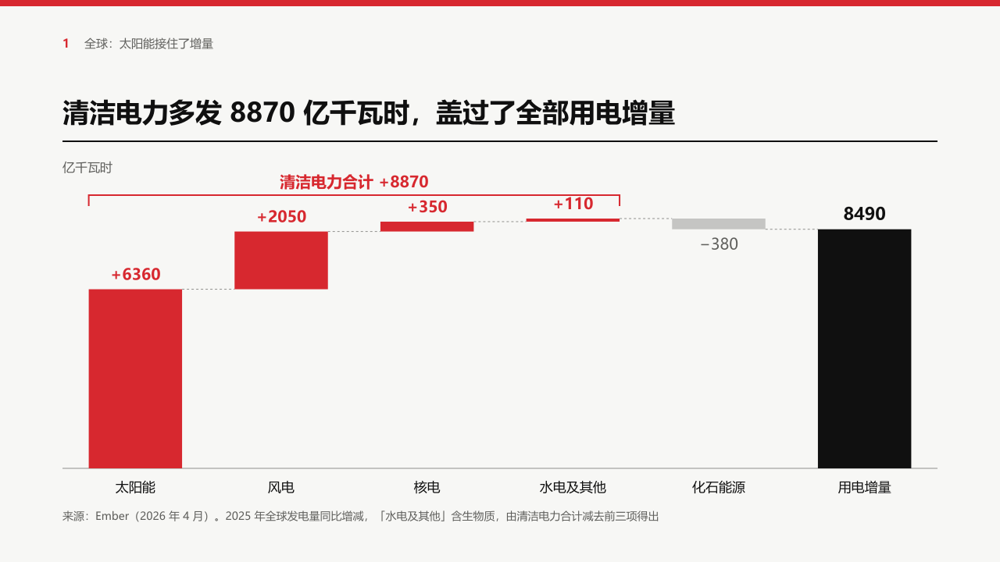

# bridge

A waterfall set by hand with no value axis: totals in a mid grey, steps in a light one, the marked step in the primary colour with its value inside it, and an axis that may start above zero.

Code: [`src/layouts/compositions/bridge.tsx`](../../../src/layouts/compositions/bridge.tsx). The bars come from the waterfall component's own arithmetic (`computeBars`, `truncatedFloor` in [`src/components/waterfall.tsx`](../../../src/components/waterfall.tsx)).

## bulletin, NEV sample, 2026-10

Settled on the mix page, beside the figure column of [`rail`](../rail/). The round's decisions are in [rounds/2026-10-03-bulletin](../../rounds/2026-10-03-bulletin/README.md).

| board (p04) | engine |
| :-: | :-: |
|  |  |

**What it looks like.** A note over the plot gives the unit and, on a truncated axis, where the axis starts (「万辆，纵轴从 200 起」, "million units, axis from 2"). Totals are 108px wide in the receded mid grey with their value bold over them, and carry two white cut marks at their foot when the axis is truncated. Steps are in the light grey with their value under a fall or over a rise. The step the author marks (`items[].emphasis`) is primary with its value at 24px reversed out of it. Dashed lines carry each level to the next bar.

**Why.** A bridge argues about one step. Setting it apart in the brand colour and its figure inside the bar makes the step and the number one object. The cut marks say the totals are not drawn to scale from zero.

**What it gave up.**

- Two to six bars counting the closing total, no level below zero, and no `emphasis_label`: the bracket and label over a marked run is the waterfall component's, and a page that wants it gets the component.
- The floor is the waterfall's own rule, so it can sit lower than a hand-picked one (200 where the board drew 250).

## swiss, power sample, 2026-10

Settled across the full width of the page, in the grid setting. The round's decisions are in [rounds/2026-10-03-swiss](../../rounds/2026-10-03-swiss/README.md).

| board (p04) | engine |
| :-: | :-: |
|  |  |

**What it looks like.** The unit over the plot on the left. The marked steps (`items[].emphasis`) in the accent with their values bold in the accent over them, an unmarked step in the light grey with its value muted under a fall, the total black with its value bold at 22px over it. Bars 120px wide on a baseline 40px over the band's foot. The `emphasis_label` stands as a 2px bracket in the accent from the first marked bar's left edge to the last one's right, 30px over the highest level the run reaches, with the label bold over it.

**Why.** The page's sentence is the clean run's total, so the run is the one red thing and its total is written over it.

**What it gave up.**

- In the grid setting the bridge takes `emphasis_label`, which the notice setting still leaves to the waterfall component.
- Values sit over or under their bars, never inside: red carries no text in swiss.
