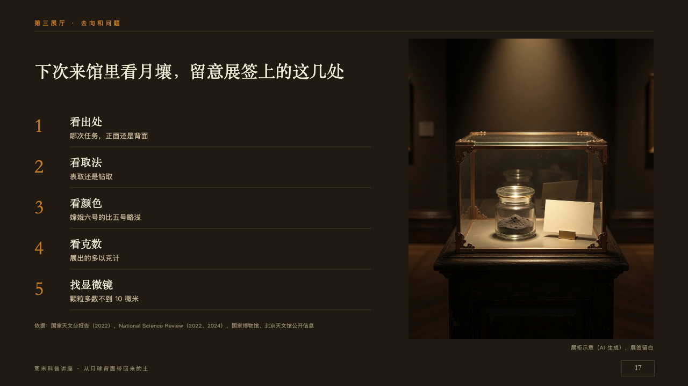
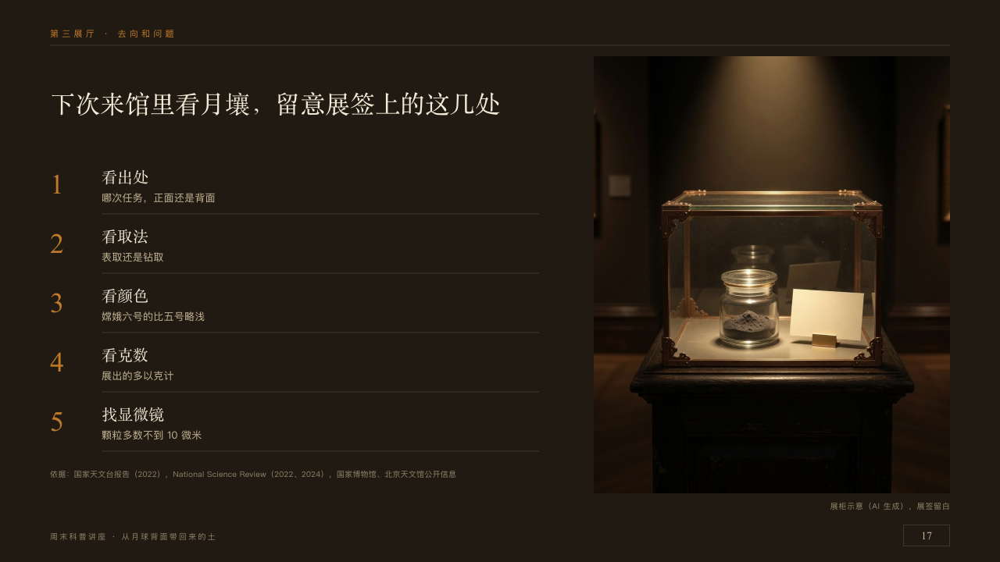

# cabinet

A case photographed tall beside what to look for in it.

Code: [`src/layouts/compositions/cabinet.tsx`](../../../src/layouts/compositions/cabinet.tsx). The header comment there is the contract. The placard setting only.

## museum, Moon soil science talk sample, 2026-10

Settled on p17. The round's decisions are in [2026-10-08-museum](../../rounds/2026-10-08-museum/README.md).

| board (p17) | engine |
| :-: | :-: |
|  |  |

**What it looks like.** The case's photograph at the right from x760, y72, 456 by 560, its caption small under it at the right. The claim over the left column only, 660px wide. Under it the points a row each 76px apart from y210: a copper numeral at 36px in the serif, the point's name at 20px in the serif and what to look at at 13px in old paper under it, a seam under each. The source under the column on y600.

**Why.** The talk ends at a display case: the page puts the case beside the five things to read on its label.

**What it gave up.**

- Takes an `image` and a `bullets` of three to five, either order. An item that opens with a short name and a colon sets the name over the rest.
- A name or a line past one line in the column sends the page back.
