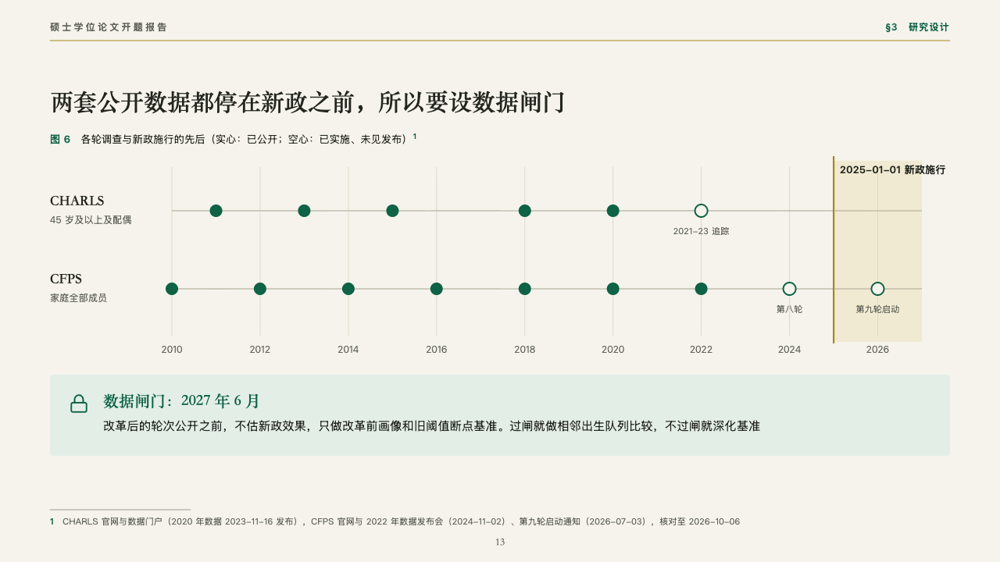
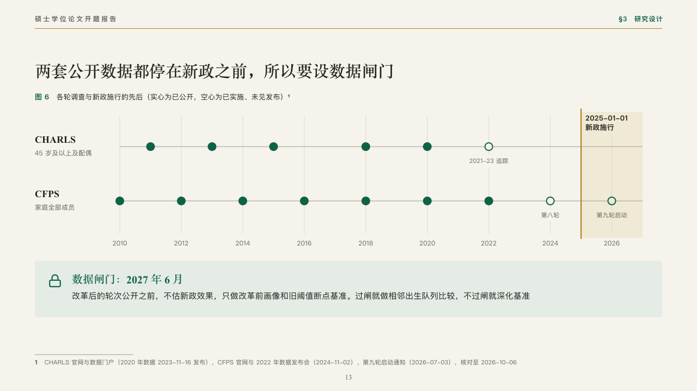

# cadence

Survey rounds against the day a reform began.

Code: [`src/layouts/compositions/cadence.tsx`](../../../src/layouts/compositions/cadence.tsx). The header comment there is the contract. The manuscript setting only.

## thesis, retirement age thesis proposal sample, 2026-10

Settled on the data gate (p13). The round's decisions are in [rounds/2026-10-06-thesis](../../rounds/2026-10-06-thesis/README.md).

| board (p13) | engine |
| :-: | :-: |
|  |  |

**What it looks like.** The figure's number and title, a year axis with a hairline every two years, a lane a survey with its name in the heading serif and what it covers under it, and a dot a round, filled for a round released and hollow for one carried out and not yet released, named under it when its title says more than its year. The span after the reform sits on the pale gold behind the lanes with a gold line where it starts and its name on the span. Under the figure the gate the plan turns on, on pale emerald with its icon and title.

**Why.** No survey round after the reform has been released. Drawing every round against the reform shows why the main design waits for a gate.

**What it gave up.**

- Takes a titled horizontal `timeline` with two `lanes` written 「name：what it covers」, milestones dated by year and one `periods` entry, then a `callout` with a title and an icon.
- A lane's or a round's name past its room, the span's name past two lines of the span or the gate past two lines sends the page back.
- The hairlines are cut clear of the round names and the span's name, and the span's name breaks at a word space rather than running past the span.
