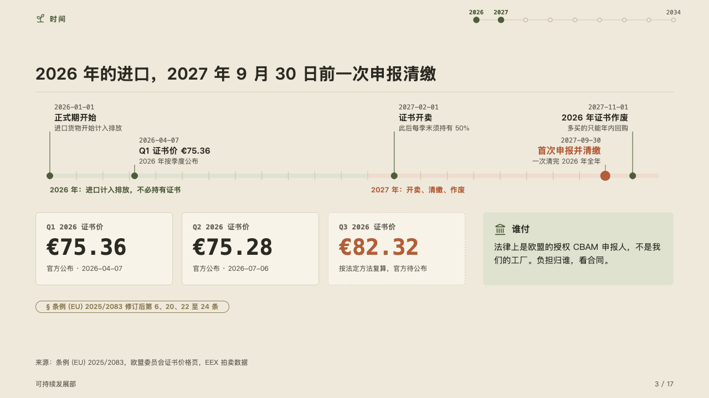
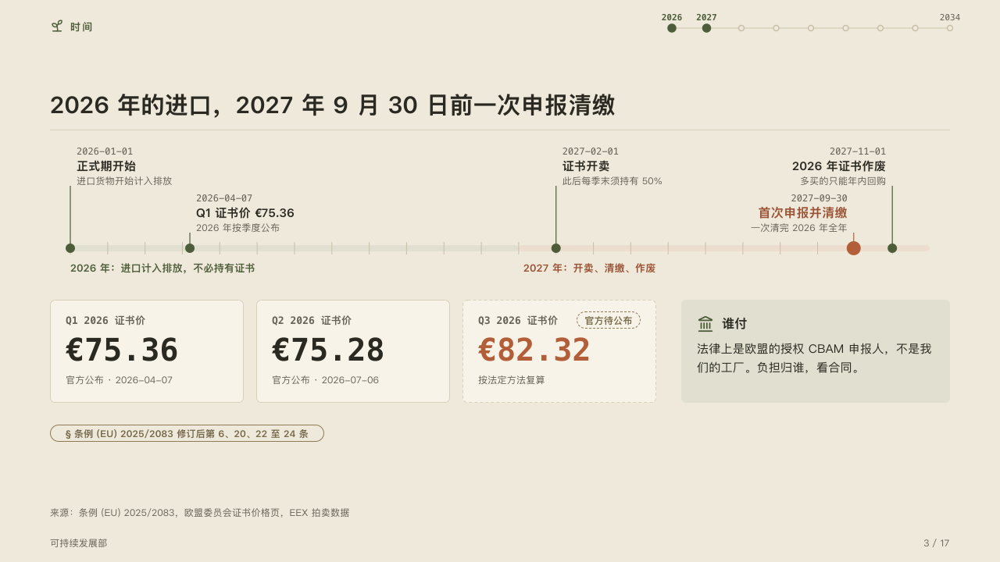

# calendar

Months laid to scale, the spans they fall in, and the figures the dates set.

Code: [`src/layouts/compositions/calendar.tsx`](../../../src/layouts/compositions/calendar.tsx). The header comment there is the contract. The yearbook setting only.

## almanac, CBAM sample, 2026-10

Settled on the timeline page (p03). The round's decisions are in [rounds/2026-10-05-almanac](../../rounds/2026-10-05-almanac/README.md).

| board (p03) | engine |
| :-: | :-: |
|  |  |

**What it looks like.** One axis across the band, a month to each tick. The timeline's spans (`periods`) lie along it as pale bands, each named under it: the span the marked milestone falls in on the accent's tint, the others on the mark's. Each milestone stands at its date, its node on the axis and a stem up to its words: the date in mono, the title bold and the description muted, on one of two tiers so neighbours stand clear, written rightward from the stem, or leftward when they would run past the page. The highlighted milestone is larger and in the accent. Under the axis a row of figure cards, each its label in mono, its figure at 40px in mono (in the accent when marked) and its note. A figure whose tag says it is pending (`basis: "pending"`) stands on a dashed card with the pill at its top right. Beside the cards a note on the mark's tint, its icon and title over its text. Under the row the page's `tag`, the law the page rests on.

**Why.** A deadline is read by where it falls among the others: the price notices, the first sale, the settlement and the date unused certificates lapse. Months drawn to scale show that the settlement comes eight months after the first sale, which evenly spaced dates would hide.

**What it gave up.**

- A `timeline` of two to eight milestones and up to three periods, every date written 2026, 2026-04 or 2026-04-07, one to three years in all, no milestone with an icon, a tag, a source or a lane. Then a `kpi_cards` of one to four items with no icon, delta, tone or source, then optionally one `callout`.
- A date written another way, words that run past the band or into a neighbour's stem, or a figure wider than its card sends the page back.
- The axis runs to the month after the latest date, so a milestone late in the last month still stands on it.
