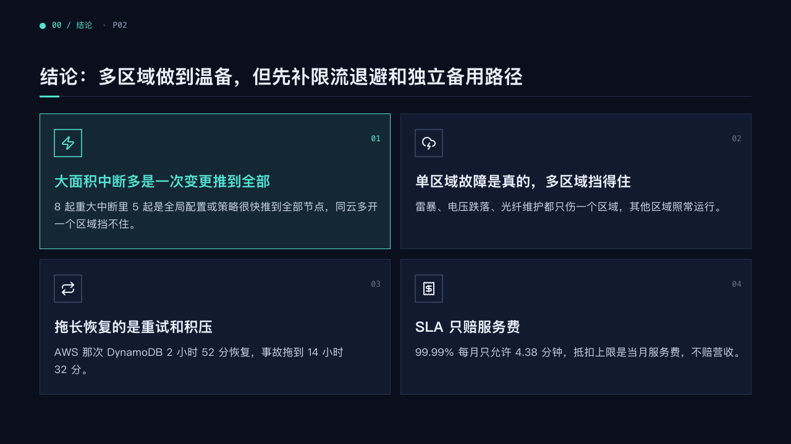
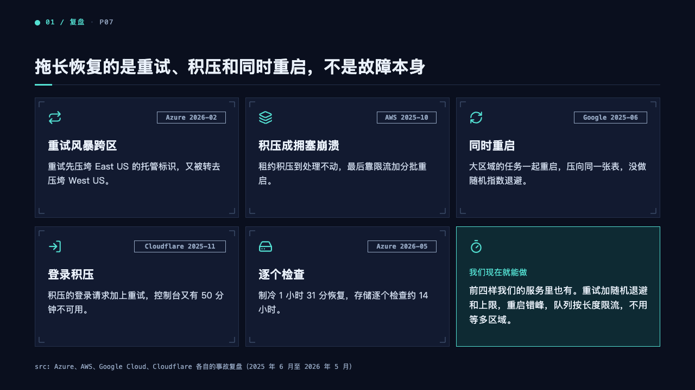
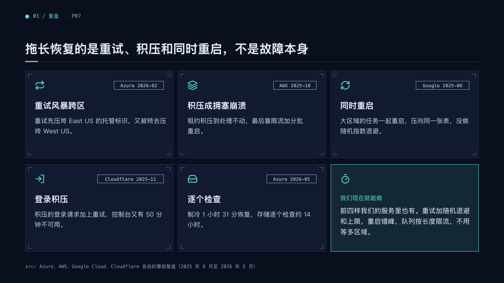

# cards

Findings as cards in a grid: verdict cards two across, or HUD cards three across with a closing cell.

Code: [`src/layouts/compositions/cards.tsx`](../../../src/layouts/compositions/cards.tsx). The header comment there is the contract. The console and dossier settings only.

## terminal, cloud outage review sample, 2026-10

| board (p02) | engine |
| :-: | :-: |
|  |  |

| board (p07) | engine |
| :-: | :-: |
|  |  |

The round's decisions are in [rounds/2026-10-05-terminal](../../rounds/2026-10-05-terminal/README.md).

**What it looks like.** Verdict cards (p02): a `row_cards` or `numbered_cards` of three to six items two across, 220px tall. Each holds its icon in a 44px square box, its number at the top right in 13px mono, its title bold at 23px and its text at 17/28. The highlighted card sits on the mark's tint inside an edge of the mark, its box, icon, number and title in the mark. Cards with no icon set their title level with their number. A closing `verdict_banner` or `callout` is a banner across the foot. HUD cards (p07): an `icon_cards` of two to six items three across, each with brackets 8px inside its edge, its icon at 26px in the mark, its `tag` at the top right in mono, its title bold at 21px and its text at 16/26. A following `callout` takes the next cell on the mark's tint, its label in mono when it is written 「标签：说明」.

**Why.** A finding that earns a symbol reads faster as a card than as a bullet, and the one the page lands on stands out without a second colour.

**What it gave up.**

- A row card's `sub` and `tone` have no place on a verdict card, and the page goes to the ordinary cards.
- Cards with an icon box need their full height and decline a closing banner.
- No count stands beside numbered cards: the number on each card is the only number.

## clinic, GLP-1 formulary review sample, 2026-10

The dossier setting's form, in [`cards-dossier.tsx`](../../../src/layouts/compositions/cards-dossier.tsx). Settled on the scope page (p14), beside a photograph set by `inset`. The round's decisions are in [rounds/2026-10-05-clinic](../../rounds/2026-10-05-clinic/README.md).

| board (p14) | engine |
| :-: | :-: |
|  |  |

**What it looks like.** The rules as white cards two by two: each its icon on a disc of the mark's tint, its title bold at 19px and its text muted at 15px, up to two lines.

**Why.** Who, where, by whom and how often are four separate rules a committee adopts one by one.

**What it gave up.**

- One `icon_cards` of two to four items, or two of two items each, none with a tag.
