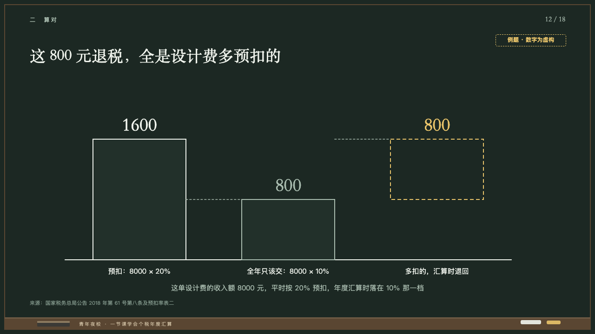
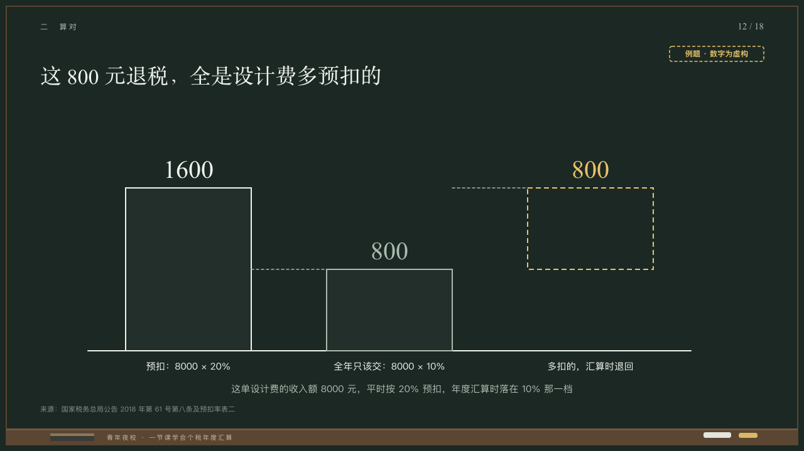

# cascade

A sum bridged as chalk bars.

Code: [`src/layouts/compositions/cascade.tsx`](../../../src/layouts/compositions/cascade.tsx). The header comment there is the contract. The chalkboard setting only.

## lecture, annual tax reconciliation evening class sample, 2026-10

Settled on p12. The round's decisions are in [2026-10-08-lecture](../../rounds/2026-10-08-lecture/README.md).

| board (p12) | engine |
| :-: | :-: |
|  |  |

**What it looks like.** Two to five bars on a chalk line on y560, 200px wide and 320px apart, centred on x620, the tallest running sum 260px. A total stands from the line as a box of the board edged in chalk white (the first) or the grey. A step floats from the running sum to where it goes, dashed `8 5` in the grey, or in yellow when marked. Each figure at 40px in the serif over its bar in its edge's ink, the label at 15px under the line, and a dashed grey line from each bar to the top of the next. A line centred at 15/26 in the grey on y608. The stamp at the top right.

**Why.** Where a refund comes from, drawn so the difference floats where it was overpaid.

**What it gave up.**

- Takes a `waterfall` of two to five items with no title, note or line over its marked bars, at most one marked, and optionally a `paragraph`. The face lets a `paragraph` stand beside a `waterfall` (`fullBodyCompanions`).
- Figures print without thousands separators on a Chinese board (1600) and with them otherwise (1,600).
