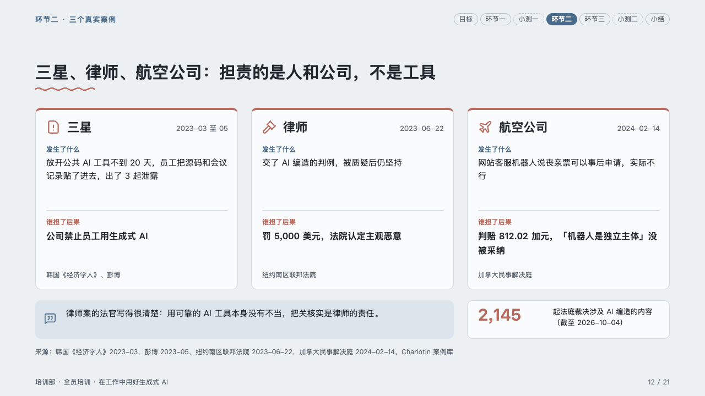
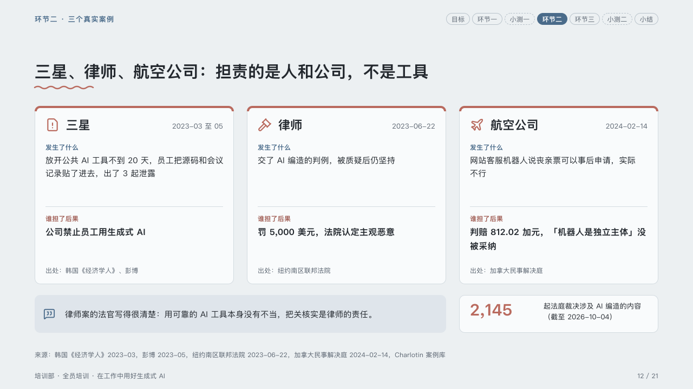

# cases

What happened and who paid, case by case.

Code: [`src/layouts/compositions/cases.tsx`](../../../src/layouts/compositions/cases.tsx). The header comment there is the contract. The lesson setting only.

## homeroom, AI-at-work training sample, 2026-10

Settled on the three cases page (p12). The round's decisions are in [rounds/2026-10-06-homeroom](../../rounds/2026-10-06-homeroom/README.md).

| board (p12) | engine |
| :-: | :-: |
|  |  |

**What it looks like.** A card per case with a 4px top edge in the pen: its icon in the pen and its name bold at 22px, its date (the row's quiet tag) muted at the top right, then the comparison's first column under its header in the mark (what happened, 15/24, up to three lines), a hairline, the second column under its header in the pen (who paid, bold 16/26), and a third column, the source, muted at the card's foot after its header. Under the cards the line the page quotes in a tip box, and beside it the figure that says it keeps happening: a number in the pen with what it counts.

**Why.** Three cases read as one argument when each answers the same two questions in the same place.

**What it gave up.**

- A `comparison` whose rows are two to four cases, each with an icon and an optional quiet tag, and whose columns are two or three, then optionally a `callout` and a `kpi_cards` of one item.
- The source line reads 「出处：…」: a column's header is the author's word and is printed with it.
- A recommended or marked row, a tag that is not quiet, or a text past its lines sends the page back.
