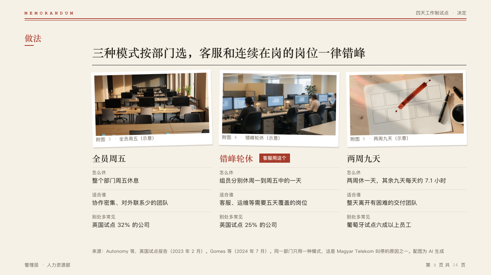

# catalog

Options shown each under its photograph, with the comparison's rows down each column.

Code: [`src/layouts/compositions/catalog.tsx`](../../../src/layouts/compositions/catalog.tsx), with the exhibit in [`exhibit.tsx`](../../../src/layouts/compositions/exhibit.tsx).

## memo, four-day week decision sample, 2026-10

Settled on the three models page (p09). The round's decisions are in [rounds/2026-10-05-memo](../../rounds/2026-10-05-memo/README.md).

| board (p09) | engine |
| :-: | :-: |
|  |  |

**What it looks like.** One column an option, 20px apart: its photograph pasted in as an exhibit 196px tall, numbered on from the face's count, its name at 22px bold in the heading face, then each row's label in 12px mono over the option's cell at 15/22, up to two lines, on hairlines. The recommended option's name is in the mark with its `recommended_label` as a filled tag after it.

**Why.** Options a team picks between are easier to tell apart by a picture of each, and the pick is marked where its name is.

**What it gave up.**

- An `image_grid` of two to four, then a `comparison` with as many options and one to four rows, no tags, no marked row. Rows taller than the band send the page back: write the cells short.
