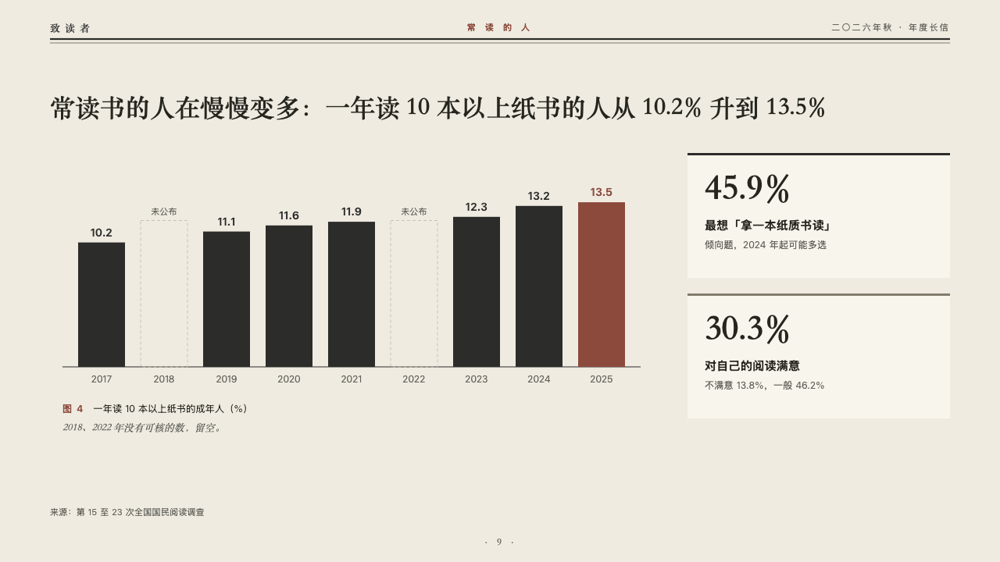
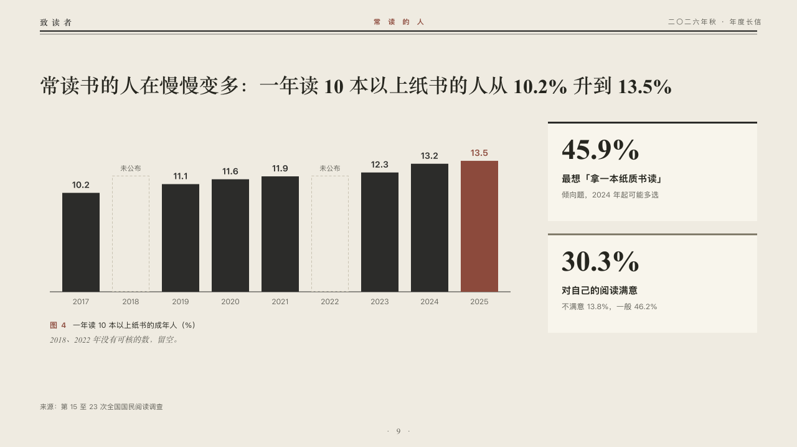

# census

A run of years as bars with dashed places for the years nobody published, beside two cards.

Code: [`src/layouts/compositions/census.tsx`](../../../src/layouts/compositions/census.tsx). The header comment there is the contract. The periodical setting only.

## journal, annual letter to readers sample, 2026-10

Settled on p09. The round's decisions are in [2026-10-07-journal](../../rounds/2026-10-07-journal/README.md).

| board (p09) | engine |
| :-: | :-: |
|  |  |

**What it looks like.** The claim over the page. Under it a bar a year on a baseline of the type's ink, every value over its bar, the marked year in brick red, and where the author kept a gap (`gaps`) a dashed outline as tall as the bars run on average with its label over it. Under the bars the figure's number and title and the editor's comment. At the right two cards on the inner page's white, each with a rule along its top, its figure large in the heading serif, its label and its note.

**Why.** A year nobody published is not a zero. A dashed place keeps the run honest without drawing a bar nobody measured.

**What it gave up.**

- Takes a titled upright bar chart of one series at zero or above, nine categories at most with its gaps, then optionally a `callout` with words alone, then a `kpi_cards` of one or two with notes and no symbol, tag, source or direction.
- A tag, ranges, changes, a reference or statuses leave the chart to the ordinary renderer. A value too wide for its bar sends the page back.
