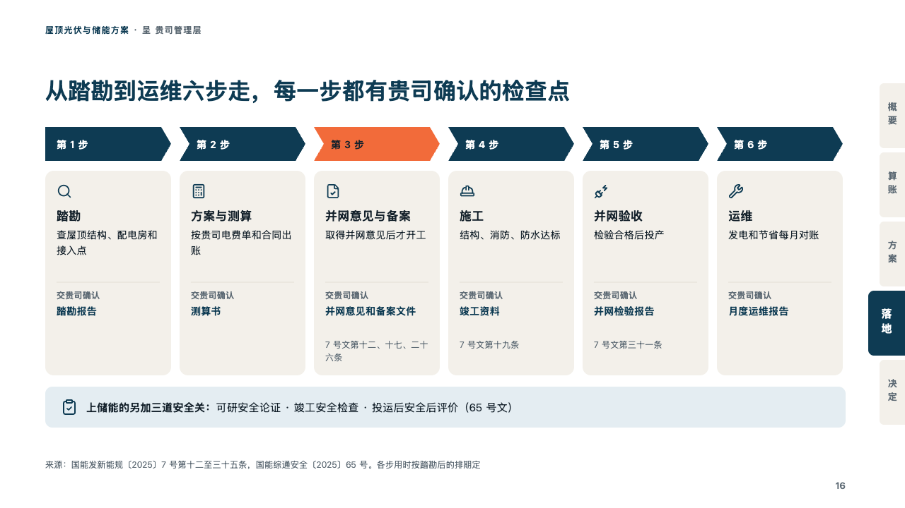
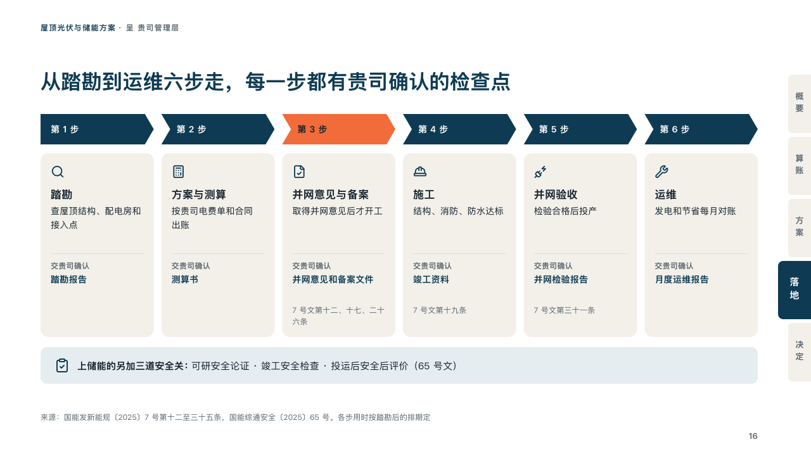

# checkpoints

How a project runs step by step, each step closed by a paper the client signs off.

Code: [`src/layouts/compositions/checkpoints.tsx`](../../../src/layouts/compositions/checkpoints.tsx). The header comment there is the contract. The binder setting only.

## proposal, rooftop solar and storage proposal sample, 2026-10

Settled on the roadmap page (p16). The round's decisions are in [rounds/2026-10-06-proposal](../../rounds/2026-10-06-proposal/README.md).

| board (p16) | engine |
| :-: | :-: |
|  |  |

**What it looks like.** Over the steps a chain of arrows in petrol, each with the step's date (「第 1 步」), the step the page dwells on in the tangerine with the ink on it. Under each arrow a card of sand: the step's icon in petrol, its name bold, what is done, a hairline, then what the paper is for in small grey (「交贵司确认」) over the paper bold in petrol, and the rule the step rests on in small grey. Under the cards, a bar of the pale petrol with the note's icon, its title bold before its text.

**Why.** A client signs off a proposal more easily when every step ends in a paper they hold. The chain says the order, the cards say what each step hands over.

**What it gave up.**

- Takes a horizontal `timeline` of three to six milestones, each with an icon and a text written "what is done。label：the paper", no tag, tone or lane, at most one highlighted, then optionally a `callout` with no tag. The full stop and the colon are declared, not printed.
- A name may run to two lines. A date past its arrow, a text past three lines, a paper or rule past two, or a bar past one line sends the page back.
