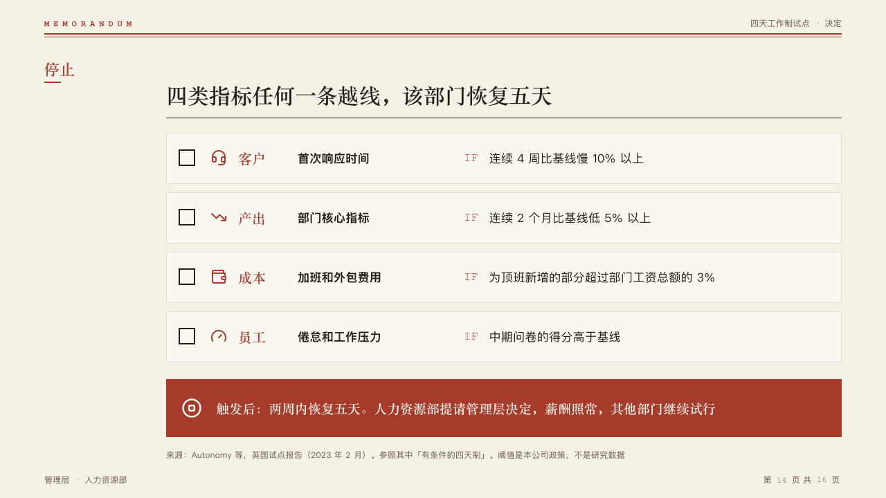

# checks

The conditions that stop a pilot, as a checklist, and what happens once one trips in a banner of the mark.

Code: [`src/layouts/compositions/checks.tsx`](../../../src/layouts/compositions/checks.tsx).

## memo, four-day week decision sample, 2026-10

Settled on the stop conditions page (p14). The round's decisions are in [rounds/2026-10-05-memo](../../rounds/2026-10-05-memo/README.md).

| board (p14) | engine |
| :-: | :-: |
|  |  |

**What it looks like.** One panel of the lifted paper a condition, 86px apart: an empty box to tick, the icon in the mark, the kind in the heading face in the mark at 20px and what is measured bold at 17px (a title written 「客户：首次响应时间」 splits at its colon), then the threshold after a typed 「IF」 in the mark. The banner of the mark across the foot carries the callout's icon and words bold in the heading face, lettered in the paper. The kind's column is 86px, wider for a longer kind, up to 160px.

**Why.** A stop condition is something someone checks every week, and the consequence is the one thing on the page in the mark at full strength.

**What it gave up.**

- A `row_cards` of three to six rows with a `text` each and no `sub`, tone or highlight, then optionally a `callout`. A kind, measure or threshold past one line sends the page back.
