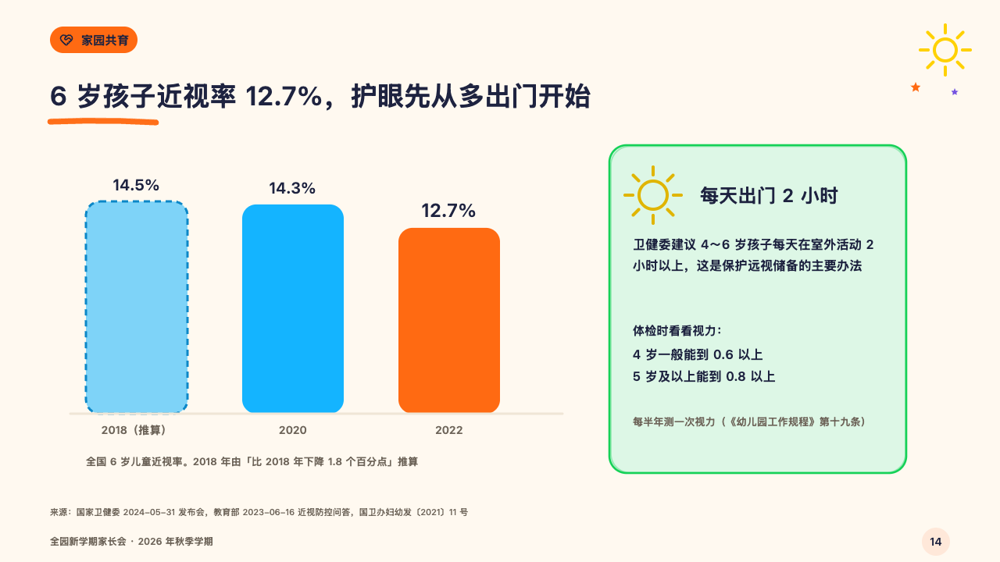
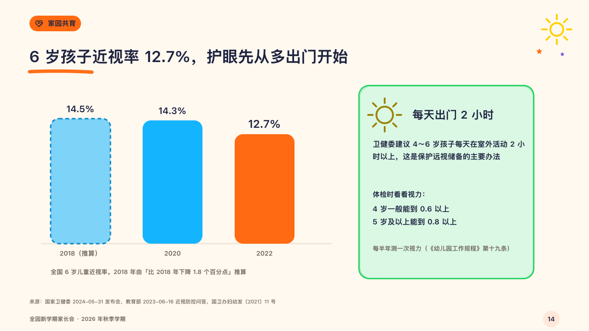

# checkup

A rate over a few years in fat bars beside what to do about it.

Code: [`src/layouts/compositions/checkup.tsx`](../../../src/layouts/compositions/checkup.tsx). The header comment there is the contract. The crayonbox setting only.

## crayon, new term parents' meeting sample, 2026-10

Settled on p14. The round's decisions are in [2026-10-08-crayon](../../rounds/2026-10-08-crayon/README.md).

| board (p14) | engine |
| :-: | :-: |
|  |  |

**What it looks like.** Two to five round-topped bars 130px wide in sky blue on a base line, each with its value over it, the one the page is about (the bar's `emphasis`) in tangerine with its value larger. A year worked out from others (`status: "estimate"`) is drawn pale inside a dashed blue outline with 「（推算）」 after its name. What the bars count (the chart's `title`) is small under them. Beside them a green card drawn by hand: a crayon sun (the panel's `sun` symbol) and the advice's name, then each row, a row the author broke into lines set as a bold lead over those lines and any other run into one paragraph after its label, and at the foot what the card rests on in the grey.

**Why.** A myopia rate means little to a parent without the one thing to do, so the bars and the advice share the page.

**What it gave up.**

- Takes a titled bar `chart` of one series of two to five points, its name carried by the title, then an `insight_panel` of one to three rows.
- A chart with a tag, a reference, changes, notes, axis titles, a forecast or a target, or a panel past its card send the page back.
- The title takes two lines when it needs them.
