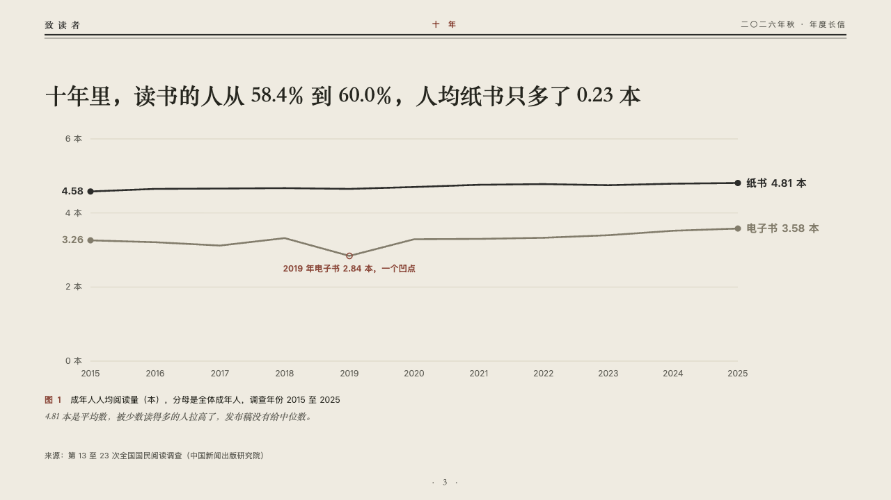
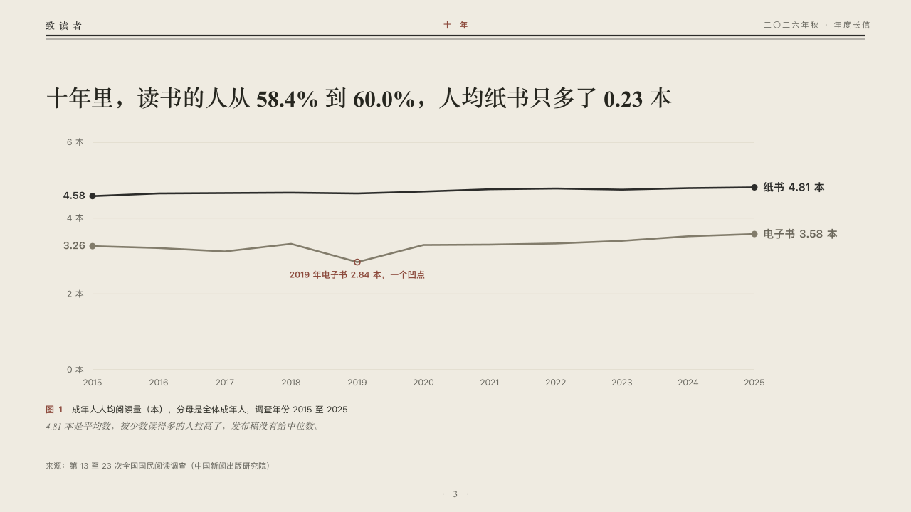

# chronicle

Years of a reading on one line.

Code: [`src/layouts/compositions/chronicle.tsx`](../../../src/layouts/compositions/chronicle.tsx). The header comment there is the contract. The periodical setting only.

## journal, annual letter to readers sample, 2026-10

Settled on p03. The round's decisions are in [2026-10-07-journal](../../rounds/2026-10-07-journal/README.md).

| board (p03) | engine |
| :-: | :-: |
|  |  |

**What it looks like.** The claim over the page. Under it a line a series across a plot of a few hairlines from zero, the ticks named with their unit at the left and every year under the axis. The series the page leads with is drawn in the type's ink and the other in the linen grey. Each line is dotted at both ends, its first value set by the first dot and its name, last value and unit after the last. A point the author noted is ringed in brick red with its note under it. Under the plot the figure's number and title and the editor's comment in italic.

**Why.** Ten years of one survey read as one run. The dip the author noted is the only red on the page.

**What it gave up.**

- Takes a titled `line` chart of one to three series over three to fifteen categories, then optionally a `callout` with words alone (the comment).
- Markers, gaps, bands, a tag, axis titles or a negative value leave the chart to the ordinary renderer.
- The hairlines are cut clear of the words on them, and a first value that would stand on a tick's name sends the page back.
