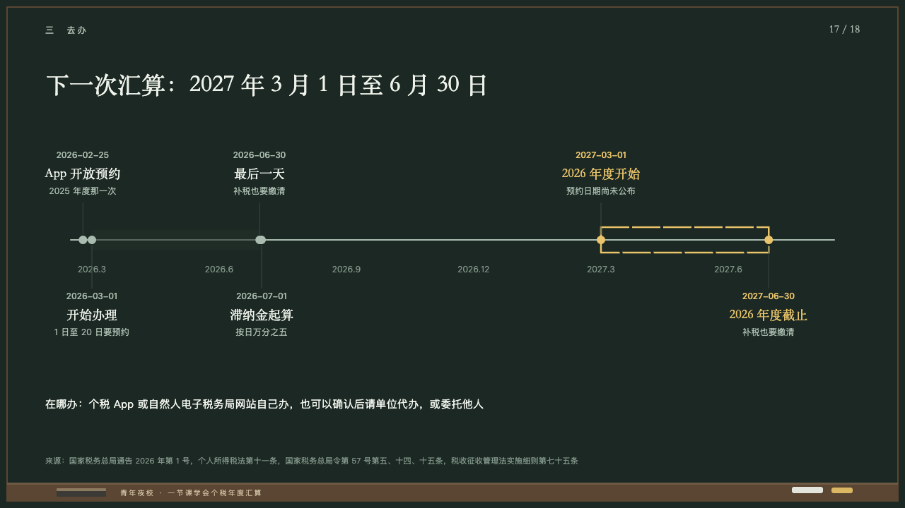
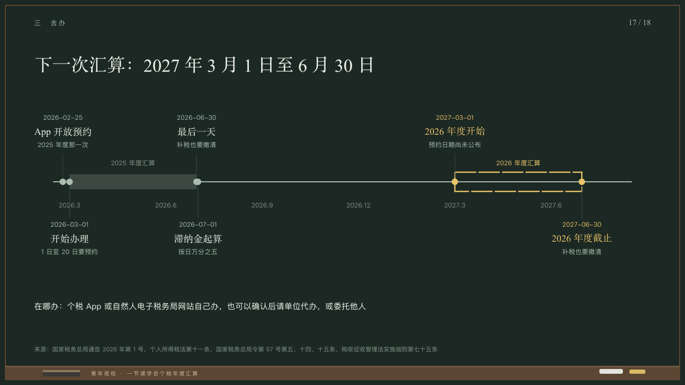

# chronology

Dates on a chalk line at their true distance.

Code: [`src/layouts/compositions/chronology.tsx`](../../../src/layouts/compositions/chronology.tsx). The header comment there is the contract. The chalkboard setting only.

## lecture, annual tax reconciliation evening class sample, 2026-10

Settled on p17. The round's decisions are in [2026-10-08-lecture](../../rounds/2026-10-08-lecture/README.md).

| board (p17) | engine |
| :-: | :-: |
|  |  |

**What it looks like.** One line in the grey from x100 to x1180 on y340, from the middle of the first date's month to the middle of the second month after the last's, a quarter's months marked under it at 12px. The timeline's `periods` stand on the line: a span gone by as a band a breath off the board, the span holding the highlighted dates as a box of yellow chalk, each span's name small over it. The dates stand on the line as dots, their words hung above and below in turn from a hairline: the date at 12px, what happens at 18/28 in the serif and a line at 12px in the grey. Dates in the span ahead are yellow. A line at 15/25 in chalk white on y560.

**Why.** The next window to file in, laid out so the year between this one and that one is felt.

**What it gave up.**

- Takes a `timeline` of three to eight milestones dated by day, in time order, one to three periods, the highlighted milestones all in one of them, and optionally a `paragraph`. Each span's name stands small over it, which the board left off.
- The span gone by is drawn a step lighter than the board drew it, so it reads on the green.
