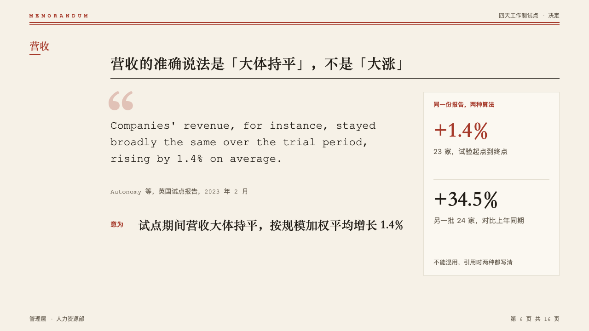
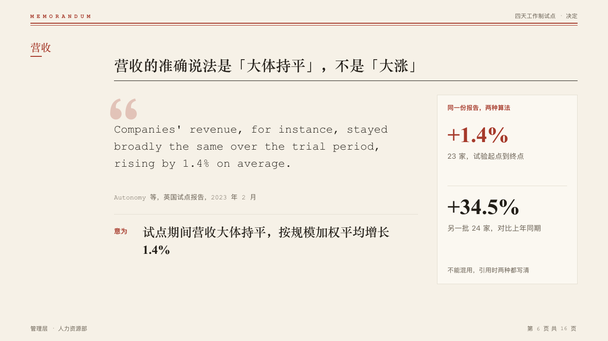

# citation

A quoted original typed as written, then what it means, with an optional panel of the figures it is read against.

Code: [`src/layouts/compositions/citation.tsx`](../../../src/layouts/compositions/citation.tsx).

## memo, four-day week decision sample, 2026-10

Settled on the revenue page (p06). The round's decisions are in [rounds/2026-10-05-memo](../../rounds/2026-10-05-memo/README.md).

| board (p06) | engine |
| :-: | :-: |
|  |  |

**What it looks like.** A large faint opening quote mark drawn as two shapes, the original at 24/36 in mono as a typewriter copies it, who said it at 14px in muted mono, a hairline, then the meaning at 26/38 bold in the heading face after its label in the mark (「意为」, "Meaning"). Beside it a panel: its label in the mark, each figure large in the heading face over its label, the marked one in the mark, and a note at the foot.

**Why.** A memo quotes a source's own words before it says what they mean, so the reader can check the reading.

**What it gave up.**

- A `blockquote`, then optionally a callout written "Label: meaning", a `kpi_cards` of two or three plain figures and a callout written "Label: note". A quote past five lines or a meaning past two sends the page back.
