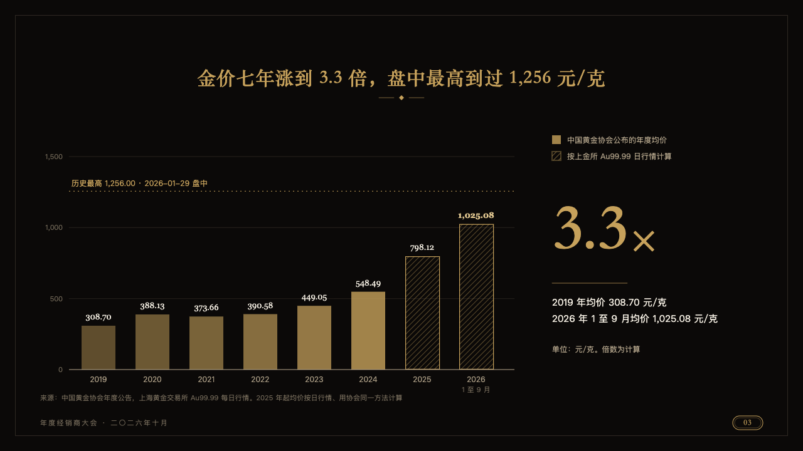
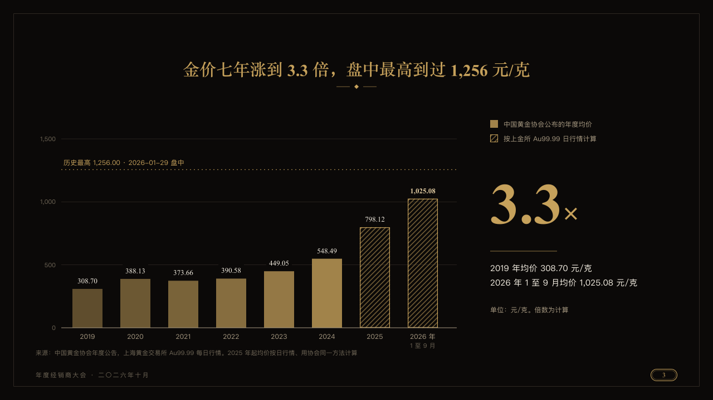

# climb

A run of yearly figures as gold bars beside the figure the run comes to.

Code: [`src/layouts/compositions/climb.tsx`](../../../src/layouts/compositions/climb.tsx). The header comment there is the contract. The invitation setting only.

## luxe, gold dealer conference sample, 2026-10

Settled on p03. The round's decisions are in [2026-10-08-luxe](../../rounds/2026-10-08-luxe/README.md).

| board (p03) | engine |
| :-: | :-: |
|  |  |

**What it looks like.** At the left the bars, each a step deeper gold than the year before, the value over each in the serif (the last lifted toward the ivory), the gridlines cut clear of the values. Where the run goes on in a second series, the figures the author worked out rather than ones the source published, its bars are hatched in gold inside a gold outline. A record the bars are read against (`reference`) is a dashed gold line across them with its label over it. At the right the two series named beside their swatches, the figure the run comes to at 104px in gold with its symbol hung on it, a short gold rule, what it compares in ivory and its note in old gold.

**Why.** A price that ran up for seven years reads as one run of bars. Where the source stopped publishing and the author's own working takes over has to show on the bars themselves.

**What it gave up.**

- Takes an upright `bar` chart of one series, or of two whose categories follow one another, with an optional `reference`, then a `kpi_cards` of one figure.
- Any other chart mark, series that share a category, more than ten bars, or a label past its room sends the page back.
