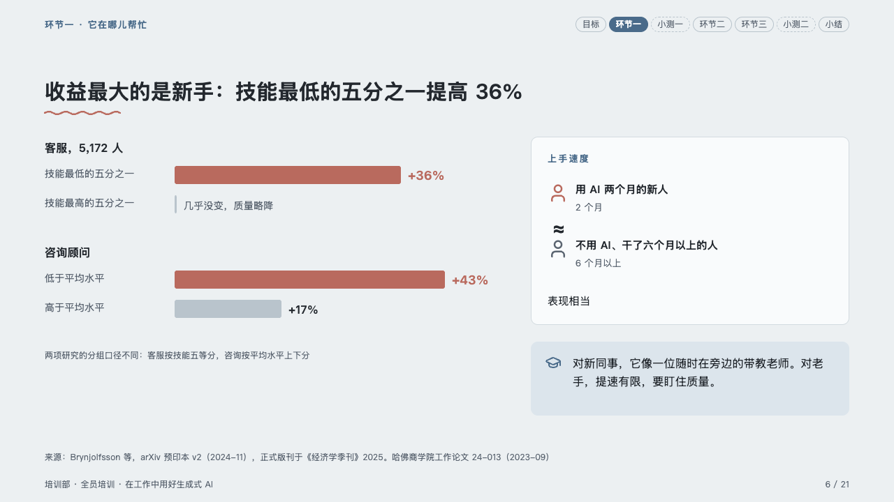
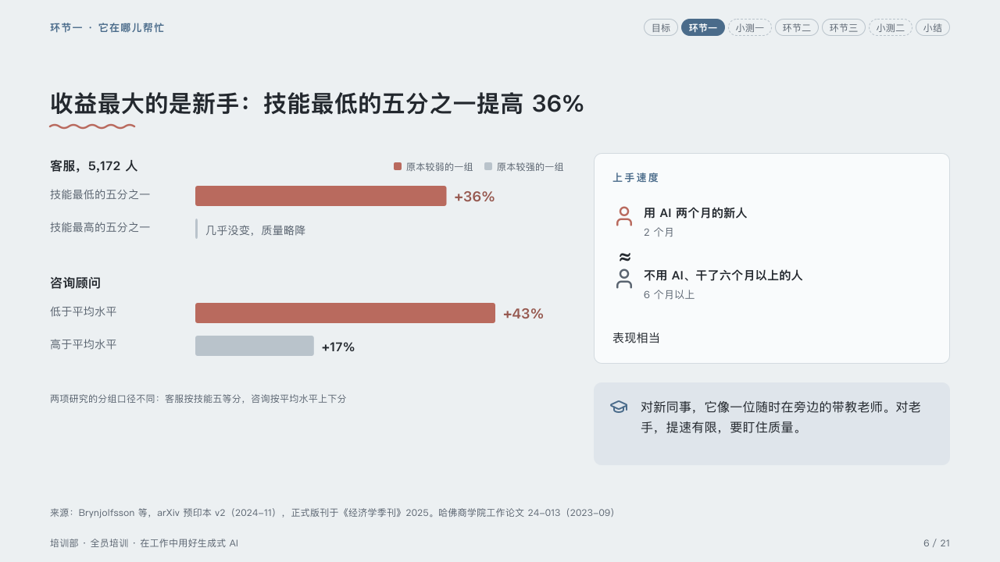

# cohorts

The weaker group against the stronger, study by study, beside who the help makes equal.

Code: [`src/layouts/compositions/cohorts.tsx`](../../../src/layouts/compositions/cohorts.tsx). The header comment there is the contract. The lesson setting only.

## homeroom, AI-at-work training sample, 2026-10

Settled on the beginners page (p06). The round's decisions are in [rounds/2026-10-06-homeroom](../../rounds/2026-10-06-homeroom/README.md).

| board (p06) | engine |
| :-: | :-: |
|  |  |

**What it looks like.** For each study, its name bold at 16px over a pair of bars on one scale: the group the page argues about (the comparison's first column) in the pen, the group it is read against (the second) in the ghost, each named at its left and its figure after its end; a group with no figure gets a 3px stub and its words. A key names the two columns, and a muted note under the pairs says how the studies cut their groups. Beside them a card weighs two people, the panel's two rows, with ≈ between them and the verdict under them, and under the card the page's tip in a box of the mark's tint.

**Why.** The finding is that the help lands on the weaker half. Two bars per study, the weaker in the pen, make that the first thing the eye compares.

**What it gave up.**

- A `comparison` of two columns and one or two rows whose every cell is written 「group：figure」, then optionally a `callout` with no icon (the note), an `insight_panel` of two rows, and optionally a `callout` (the tip).
- The key is the engine's, not the board's: the board printed no column names, and a comparison's columns are the author's words.
- A cell with no colon, or a group, a study's name or a figure past its room, sends the page back.
