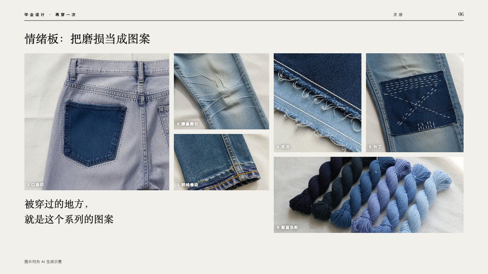
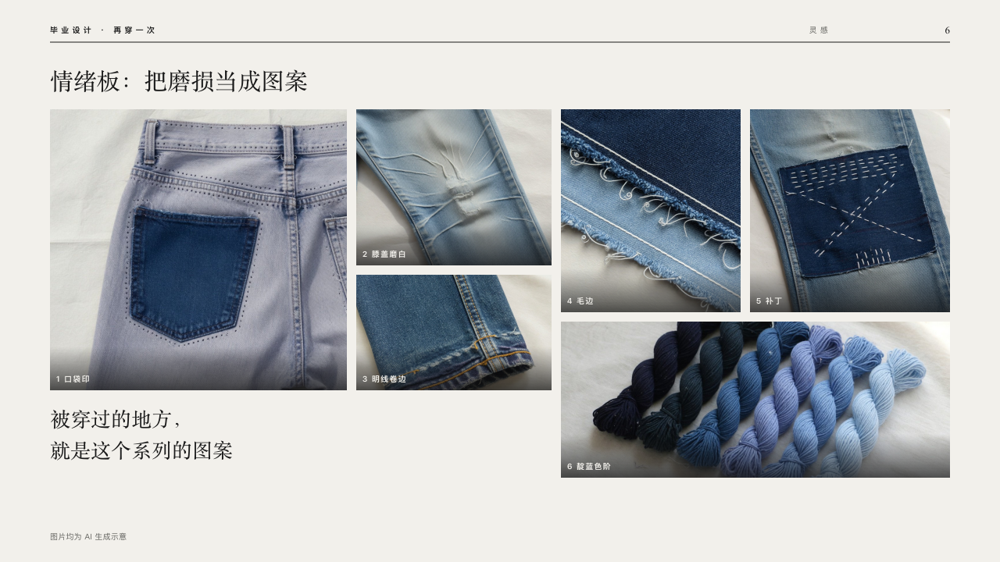

# collage

A moodboard of six pictures of different sizes.

Code: [`src/layouts/compositions/collage.tsx`](../../../src/layouts/compositions/collage.tsx). The header comment there is the contract. The lineup setting only.

## runway, graduation collection review sample, 2026-10

Settled on p06. The round's decisions are in [2026-10-08-runway](../../rounds/2026-10-08-runway/README.md).

| board (p06) | engine |
| :-: | :-: |
|  |  |

**What it looks like.** The claim at 30px over the page. A large picture at the left (380 by 360), two stacked beside it, two side by side and a long one under them at the right. Each picture's number and caption stand in small white bold type at its bottom left over a soft dark fade. Under the large picture a line at 26/40 in the serif says what the pictures are for. The source under it on y680.

**Why.** Inspiration is shown, not listed: six details of worn denim of different weights read as one board.

**What it gave up.**

- Takes an `image_grid` of six captioned pictures with no icon or tag, not led by one, then optionally a `paragraph`. A picture's `crop` is kept.
- The board's text shadow under the captions became a fade of the stage: PowerPoint keeps no shadow on text.
- A caption wider than its picture or a line past two sends the page back.
