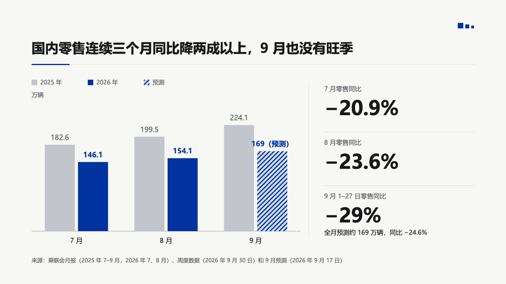
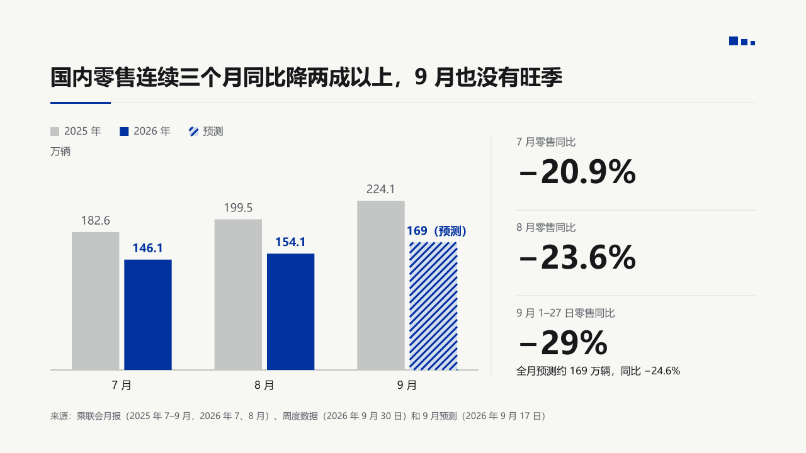
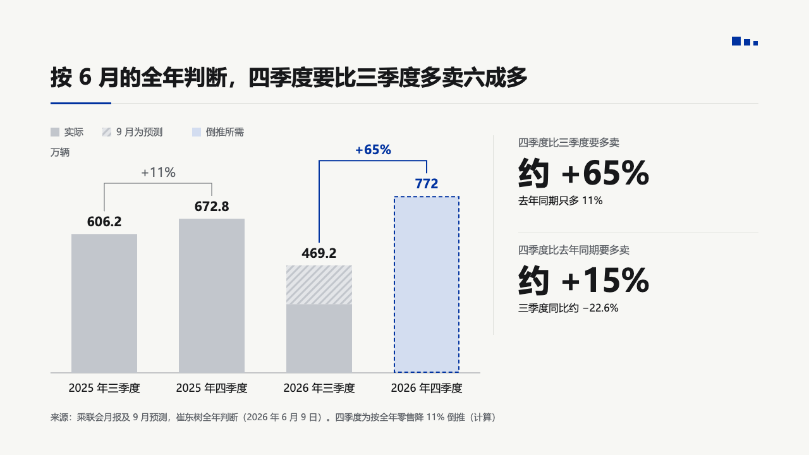
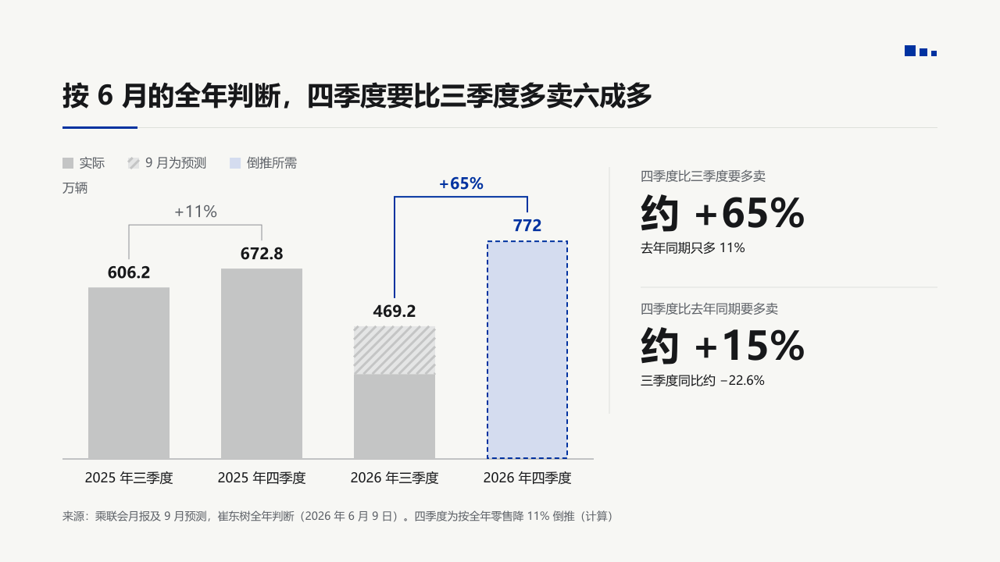
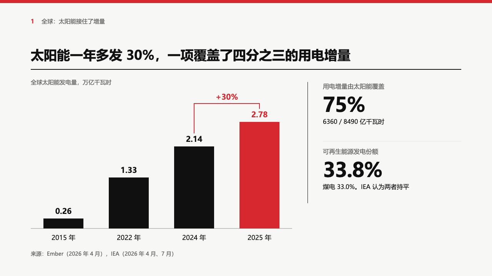
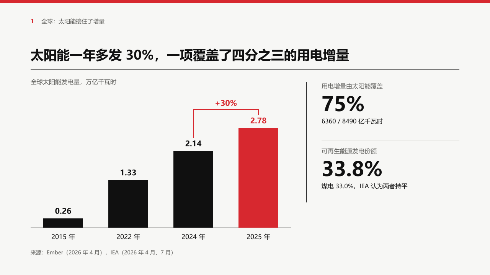
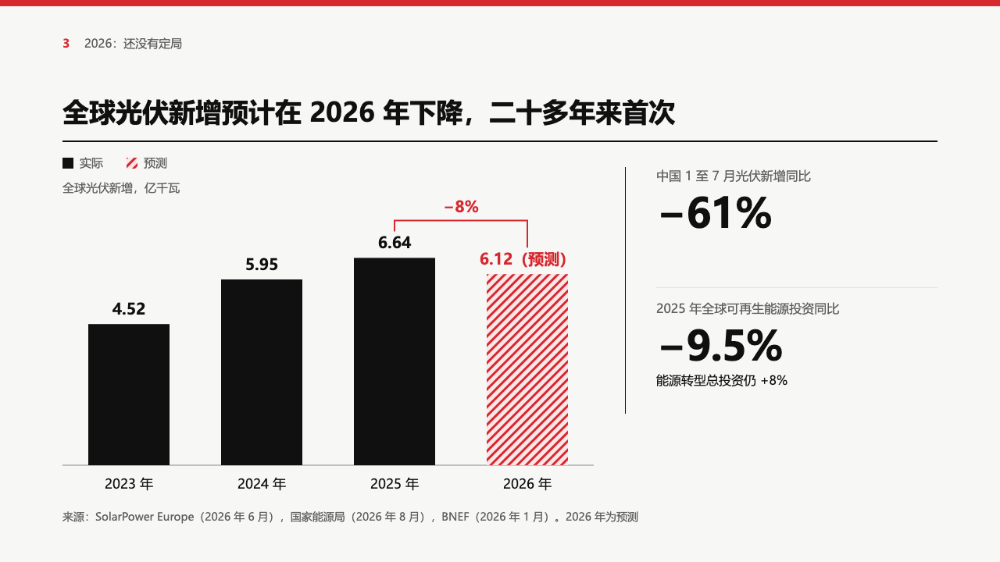
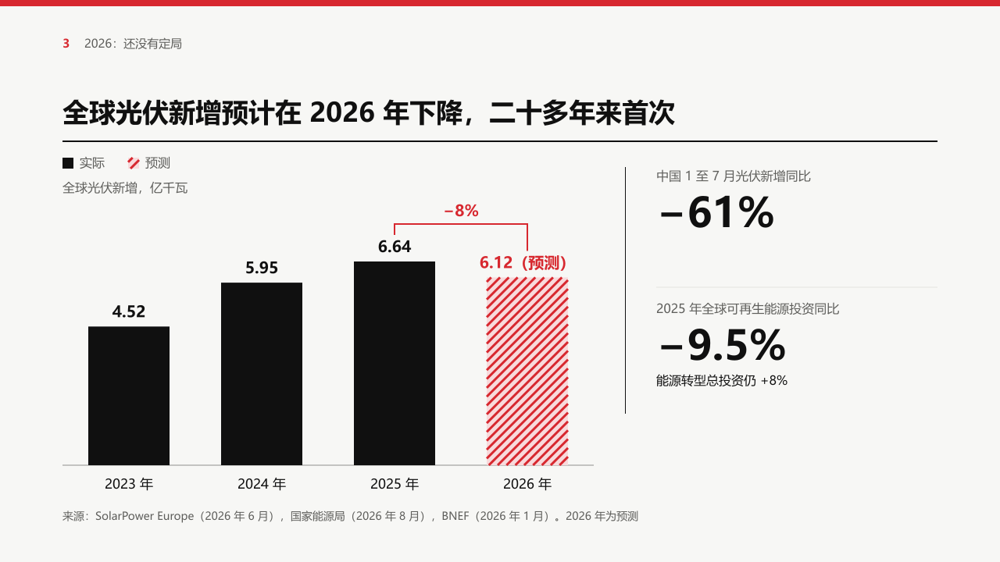

# columns

An upright bar chart set by hand with no value axis: the legend and the unit over the plot, every bar carrying its value, the marked series alone in the primary colour.

Code: [`src/layouts/compositions/columns.tsx`](../../../src/layouts/compositions/columns.tsx), with the plots' shared pieces in [`plot.tsx`](../../../src/layouts/compositions/plot.tsx). The header comment there is the contract.

## bulletin, NEV sample, 2026-10

Settled on two pages, both beside the figure column of [`rail`](../rail/). The round's decisions are in [rounds/2026-10-03-bulletin](../../rounds/2026-10-03-bulletin/README.md).

| board (p03) | engine |
| :-: | :-: |
|  |  |

| board (p09) | engine |
| :-: | :-: |
|  |  |

**What it looks like.** The legend runs along the top left at 16px with 14px swatches, the unit under it, and no axis, ticks or grid. Bars stand on one baseline: a lone bar per category is up to 104px wide, grouped bars up to 76px with 8px between them. Every bar prints its value: 20px bold over a lone bar, 18px over a grouped one, bold primary on the marked series and muted on the rest. A forecast bar (`status: "forecast"`) is hatched in its own colour over a pale tint and its value says 「（预测）」 or "(forecast)". A target bar (`status: "target"`) is a dashed outline over a pale tint. A change the author asks for (`chart.changes`) is a square bracket over the two columns with the change on it, in primary when it ends on the marked series and muted otherwise.

**Why.** On a page that argues about one series, an axis is one more thing to read before the bar the page is about. Printing every value lets the reader check the claim without measuring. A forecast drawn solid would read as a reported figure, and a target drawn solid as something already sold.

**What it gave up.**

- One to three upright series (two to four stacked) over two to six categories, every value zero or more. Negative values, a numeric x axis and an x axis title go to the ordinary chart.
- No gridlines and no axis: a page that needs the reader to compare against a scale should use the ordinary chart.
- When the labels, brackets and legend cannot be set apart, the bars shrink toward half the board's height before the composition declines.

## swiss, power sample, 2026-10

Settled on two pages, both beside the figure column of [`rail`](../rail/), in the grid setting. The round's decisions are in [rounds/2026-10-03-swiss](../../rounds/2026-10-03-swiss/README.md).

| board (p05) | engine |
| :-: | :-: |
|  |  |

| board (p13) | engine |
| :-: | :-: |
|  |  |

**What it looks like.** Bars black, the one the author marks (`data[].emphasis` on a point, or `emphasis` on a series) in the accent, a forecast hatched in the accent over its pale tint. Every value bold at 20px over its bar, in the bar's colour. One series names itself in the unit line (「全球太阳能发电量，万亿千瓦时」) 24px into the band, and the legend appears only to tell reported bars from forecast ones (实际, 预测) or several series apart. The change the author brackets is the page's change, so its bracket is 2px in the accent with its figure bold over it. The tallest column takes nine tenths of the bars' height over a baseline 44px above the band's foot.

**Why.** Swiss draws data black and spends red on the one bar the page is about. A forecast is red because on this page the forecast is the point.

**What it gave up.**

- With no value axis there is no tick to round to, so the scale follows the tallest column (the board rounded 6.64 up to 7.5 by hand, which the nine tenths lands within 4px of).
- Under a share bar (p08) the bars come down to 100px tall, where the notice setting stops at 150.
