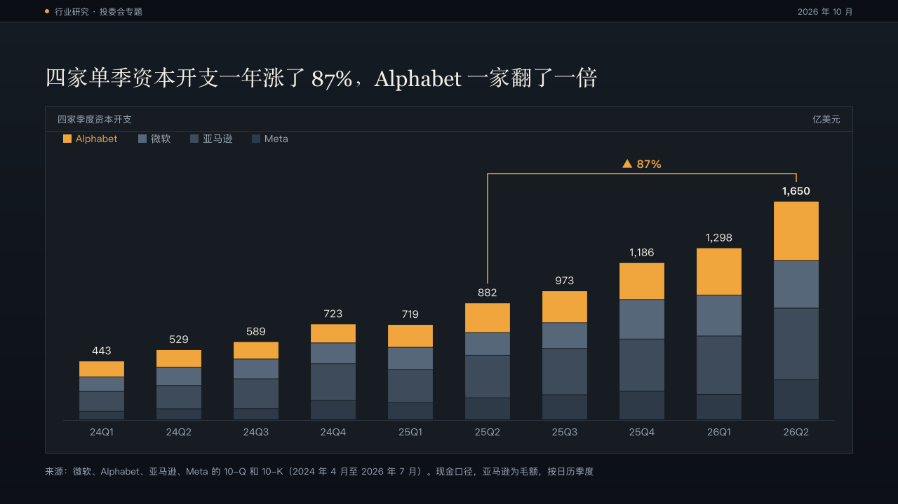
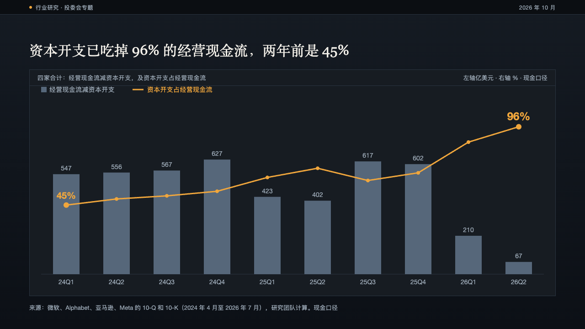
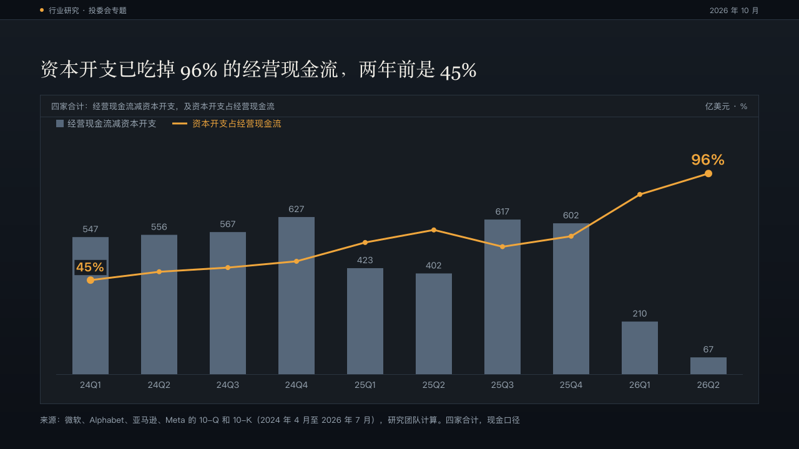
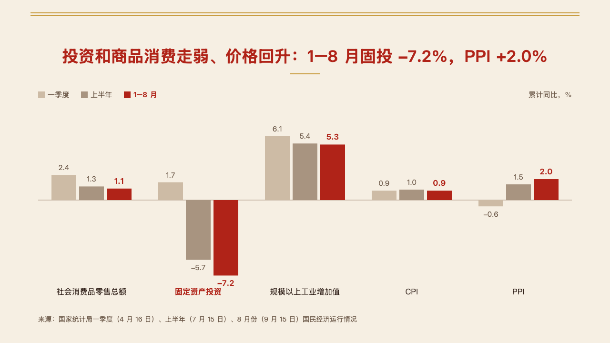
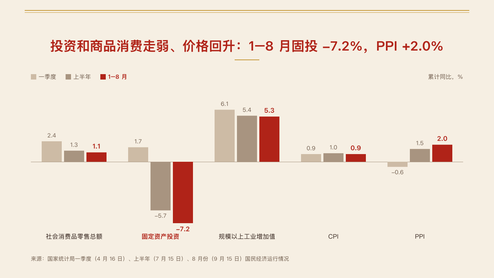

# columns

An upright bar chart set by hand with no value axis: the legend and the unit over the plot, every bar carrying its value, the marked series alone in the primary colour.

Code: [`src/layouts/compositions/columns.tsx`](../../../src/layouts/compositions/columns.tsx), with the plots' shared pieces in [`plot.tsx`](../../../src/layouts/compositions/plot.tsx). The header comment there is the contract.

## bulletin, NEV sample, 2026-10

Settled on two pages, both beside the figure column of [`rail`](../rail/). The round's decisions are in [rounds/2026-10-03-bulletin](../../rounds/2026-10-03-bulletin/README.md).

| board (p03) | engine |
| :-: | :-: |
|  |  |

| board (p09) | engine |
| :-: | :-: |
|  |  |

**What it looks like.** The legend runs along the top left at 16px with 14px swatches, the unit under it, and no axis, ticks or grid. Bars stand on one baseline: a lone bar per category is up to 104px wide, grouped bars up to 76px with 8px between them. Every bar prints its value: 20px bold over a lone bar, 18px over a grouped one, bold primary on the marked series and muted on the rest. A forecast bar (`status: "forecast"`) is hatched in its own colour over a pale tint and its value says 「（预测）」 or "(forecast)". A target bar (`status: "target"`) is a dashed outline over a pale tint. A change the author asks for (`chart.changes`) is a square bracket over the two columns with the change on it, in primary when it ends on the marked series and muted otherwise.

**Why.** On a page that argues about one series, an axis is one more thing to read before the bar the page is about. Printing every value lets the reader check the claim without measuring. A forecast drawn solid would read as a reported figure, and a target drawn solid as something already sold.

**What it gave up.**

- One to three upright series (two to four stacked) over two to six categories, every value zero or more. Negative values, a numeric x axis and an x axis title go to the ordinary chart.
- No gridlines and no axis: a page that needs the reader to compare against a scale should use the ordinary chart.
- When the labels, brackets and legend cannot be set apart, the bars shrink toward half the board's height before the composition declines.

## swiss, power sample, 2026-10

Settled on two pages, both beside the figure column of [`rail`](../rail/), in the grid setting. The round's decisions are in [rounds/2026-10-03-swiss](../../rounds/2026-10-03-swiss/README.md).

| board (p05) | engine |
| :-: | :-: |
|  |  |

| board (p13) | engine |
| :-: | :-: |
|  |  |

**What it looks like.** Bars black, the one the author marks (`data[].emphasis` on a point, or `emphasis` on a series) in the accent, a forecast hatched in the accent over its pale tint. Every value bold at 20px over its bar, in the bar's colour. One series names itself in the unit line (「全球太阳能发电量，万亿千瓦时」) 24px into the band, and the legend appears only to tell reported bars from forecast ones (实际, 预测) or several series apart. The change the author brackets is the page's change, so its bracket is 2px in the accent with its figure bold over it. The tallest column takes nine tenths of the bars' height over a baseline 44px above the band's foot.

**Why.** Swiss draws data black and spends red on the one bar the page is about. A forecast is red because on this page the forecast is the point.

**What it gave up.**

- With no value axis there is no tick to round to, so the scale follows the tallest column (the board rounded 6.64 up to 7.5 by hand, which the nine tenths lands within 4px of).
- Under a share bar (p08) the bars come down to 100px tall, where the notice setting stops at 150.

## ledger, AI capex sample, 2026-10

In the panel setting, settled on two pages and used again beside figure panels on a third ([compositions/rail](../rail/ledger-p11.board.png)). The round's decisions are in [rounds/2026-10-04-ledger](../../rounds/2026-10-04-ledger/README.md).

| board (p04) | engine |
| :-: | :-: |
|  |  |

| board (p06) | engine |
| :-: | :-: |
|  |  |

**What it looks like.** The chart in a panel: named by its one series, or by the value axis title when there are several, with the unit on the right of the title bar (the left axis's and, for a combo, the right axis's after it, "亿美元 · %"). A stack lists its series under the bar from the top of the stack down, the marked series in amber and the others in the slates nearest the top first. Every column carries its figure, a stack its total. A change the author asked for (`changes`) is a bracket over the two columns with its figure after an arrow, in amber when no single bar is marked, in the direction's colour when one is, and the column it ends on prints its total bold. A combo is one bar series and one line on the right axis: the marked line in amber with small dots, its two ends larger, and its first and last values over them on a plate of the panel's colour where they meet a bar.

**Why.** The stack's change and the line's climb are what these pages say. Amber marks them once, and the slates keep every other series readable without competing.

**What it gave up.**

- No value axis. Bars scale to their own band, and a combo's line to its own.
- A single bar series, a stack of two to four, or a combo of one bar series and one line. A grouped bar chart or an axis title on the categories goes to the ordinary chart.
- The title bar prints the unit only. How the figures were counted goes in the source.

## vermilion, government work report sample, 2026-10

The seal setting's form, `columnsSeal` in [`plot-seal.tsx`](../../../src/layouts/compositions/plot-seal.tsx). The round's decisions are in [rounds/2026-10-04-vermilion](../../rounds/2026-10-04-vermilion/README.md).

| board (p10) | engine |
| :-: | :-: |
|  |  |

**What it looks like.** An upright bar chart of one to three series over two to six categories. The legend at 15px over the plot on the left, the unit on the right. Every bar prints its value. A value below zero hangs under the zero line with its value under it, the zero line set so the lowest value clears the categories. The series the author marks, or the one holding the marked bar, takes the mark, and the marked bar's category name turns bold in the mark. The other series step back in the chart palette after its lead, nearest the mark first (vermilion's warm greys).

**Why.** Investment falling below zero while prices turn up is the page's argument. Hanging the negatives under the line shows it without a value axis.

**What it gave up.**

- No forecast or target points, no x-axis title, no bands. A chart with any of them goes to the ordinary renderer.
