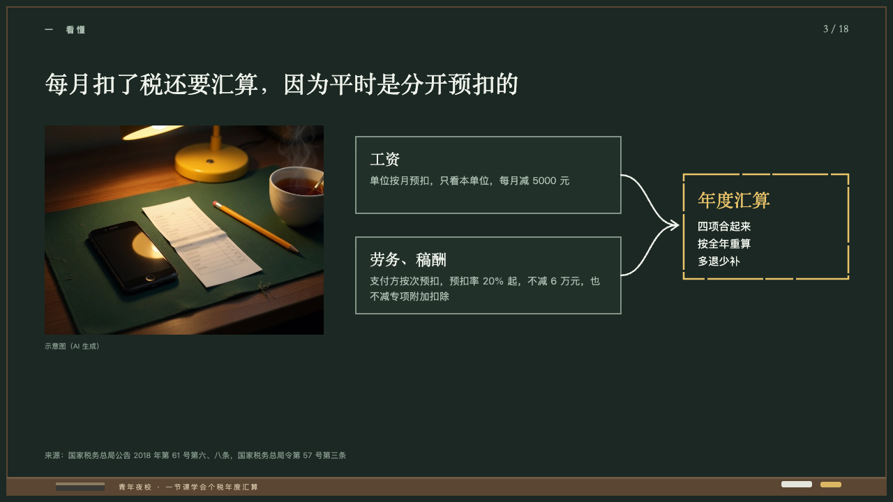
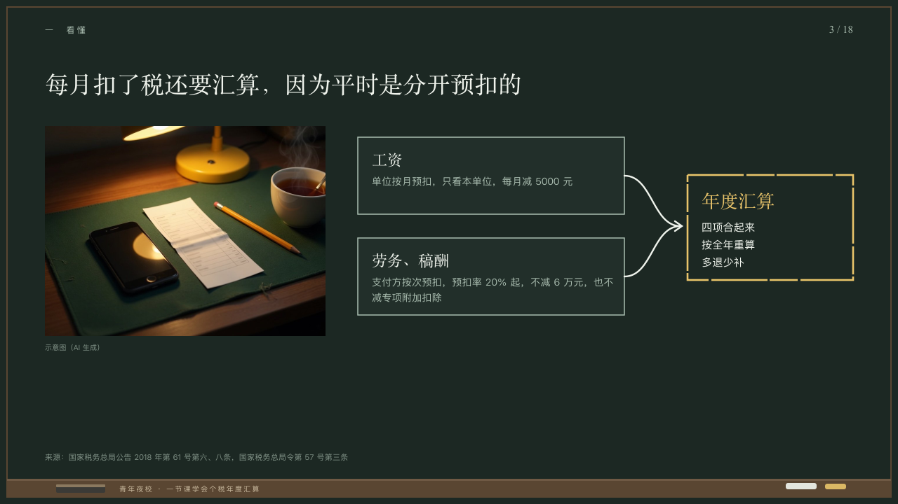

# confluence

Two paths that meet in one result.

Code: [`src/layouts/compositions/confluence.tsx`](../../../src/layouts/compositions/confluence.tsx). The header comment there is the contract. The chalkboard setting only.

## lecture, annual tax reconciliation evening class sample, 2026-10

Settled on p03. The round's decisions are in [2026-10-08-lecture](../../rounds/2026-10-08-lecture/README.md).

| board (p03) | engine |
| :-: | :-: |
|  |  |

**What it looks like.** A photograph 400 by 300 at (64, 180) with its caption at 10px under it. Beside it two boxes of the board 380 by 110 at y196 and y340, a hairline edge in the grey, each a path's name at 22/30 in the serif and its note at 14/22 in the grey, two lines at most. From the middle of each box's right edge a chalk line 2.4px curves to (970, 323), where an arrow meets a box of yellow chalk 236 by 150, the result's name at 26/36 in yellow and what it does at 15/25 in chalk white, the author's breaks kept.

**Why.** Withholding happens in two places that never see each other, and the year's reckoning is where they meet.

**What it gave up.**

- Takes an `image` then a `concept_equation` of two terms, each a label and a note, and a result with a note. A value, an icon or an exclusion goes to the ordinary renderer.
- The result's note keeps the author's line breaks, three lines at most, as the board stacks it in its narrow box.
