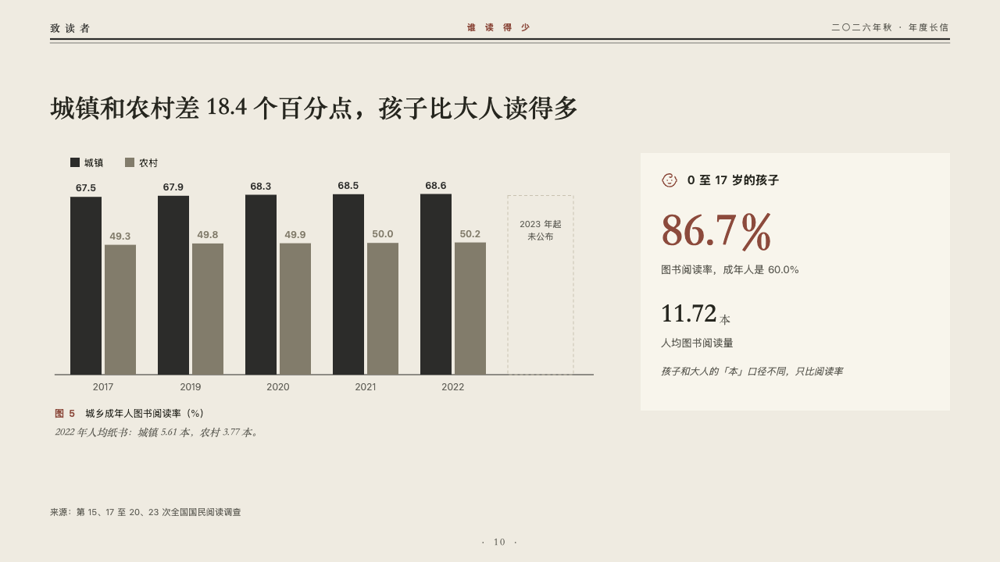
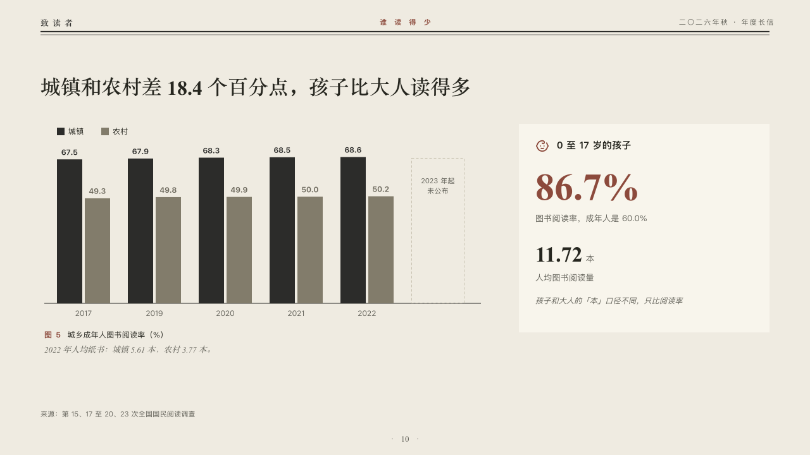

# contrast

Two groups year by year as pairs of bars, beside a card about a third.

Code: [`src/layouts/compositions/contrast.tsx`](../../../src/layouts/compositions/contrast.tsx). The header comment there is the contract. The periodical setting only.

## journal, annual letter to readers sample, 2026-10

Settled on p10. The round's decisions are in [2026-10-07-journal](../../rounds/2026-10-07-journal/README.md).

| board (p10) | engine |
| :-: | :-: |
|  |  |

**What it looks like.** The claim over the page. Under it a key, a pair of bars a year, the first group in the type's ink and the second in the linen grey, every value over its bar, and a gap as a dashed outline a pair wide with its name and label inside it. Under the bars the figure's number and title and the editor's comment. At the right a card on the inner page's white: the first figure's tag as its title beside its symbol, the figure huge (in brick red when marked) with its label, the second figure with its unit and label, and an italic line at the foot.

**Why.** Town and country are read side by side every year. Children are counted another way, so they get their own card rather than a third bar.

**What it gave up.**

- Takes a titled upright bar chart of two series at zero or above, seven categories at most with its gaps, then optionally a `callout` with words alone, then a `kpi_cards` of two, the first with a symbol and a tag and no note, the second with a note.
- A marked series, a tag, ranges, changes, a reference or statuses leave the chart to the ordinary renderer.
