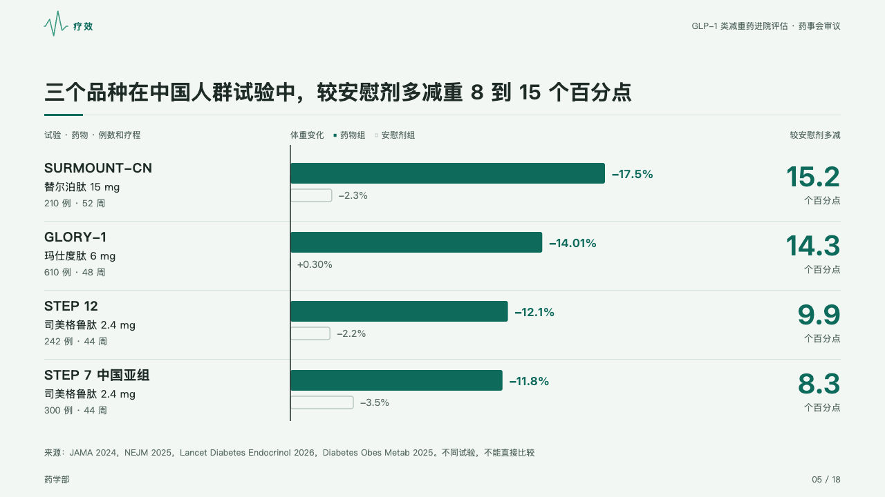
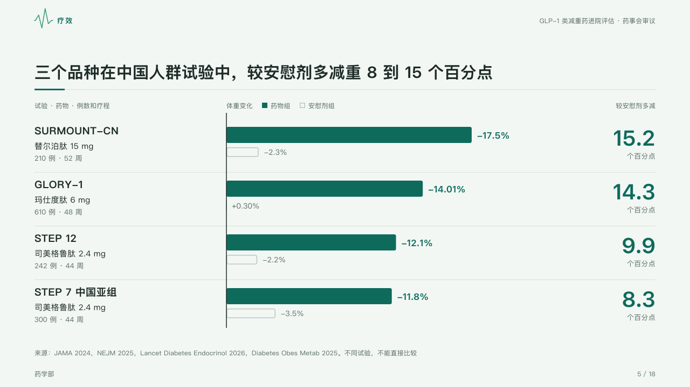

# controlled

Each trial's result against its control: the drug as a solid bar, the control as an outline under it, and how much more the drug did at the right.

Code: [`src/layouts/compositions/controlled.tsx`](../../../src/layouts/compositions/controlled.tsx). The header comment there is the contract. The dossier setting only.

## clinic, GLP-1 formulary review sample, 2026-10

Settled on the Chinese-population page (p05). The round's decisions are in [rounds/2026-10-05-clinic](../../rounds/2026-10-05-clinic/README.md).

| board (p05) | engine |
| :-: | :-: |
|  |  |

**What it looks like.** One row a trial, 100px apart: its name bold at 19px, the drug and its dose at 15px and the size and length at 13px muted, from a category written 「名称 · 药物 · 细节」. From one axis the drug group's change runs as a 30px bar in the mark with its figure at its end, and the control's as an 18px outline in the ghost ink under it. A control that moved the other way (a placebo group that gained) is a tick on the axis with its figure beside it, never a bar running backwards. At the right the gain over the control bold at 40px in the mark, its unit under it, from a `kpi_cards` with one item a row. The legend keys the solid drug bar and the hollow control.

**Why.** A trial is read against its own control, and trials of different drugs are not compared bar to bar: the right column says what each trial showed on its own terms.

**What it gave up.**

- A horizontal `bar` chart of two to four categories and two series, one marked, then a `kpi_cards` with an item per category, its labels the rows' names.
- A chart with a tag, changes, bands or point marks, or items that do not match the rows, send the page back.
