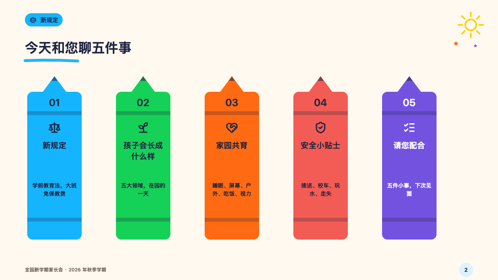

# crayons

The contents of a meeting as a row of crayons, one a part.

Code: [`src/layouts/compositions/crayons.tsx`](../../../src/layouts/compositions/crayons.tsx). The header comment there is the contract. The crayonbox setting only.

## crayon, new term parents' meeting sample, 2026-10

Settled on p02. The round's decisions are in [2026-10-08-crayon](../../rounds/2026-10-08-crayon/README.md).

| board (p02) | engine |
| :-: | :-: |
|  |  |

**What it looks like.** The claim over the page. Under it a crayon a part, standing on end 140px wide in the deck's section colours in order: a sharpened tip with its lead, a body with two bands across it, the part's number at the top (26px), its symbol (32px), its name (20/28) and a line of what it covers (14/21), all in the ink the crayon carries, white on the purple.

**Why.** Each part of the meeting is one crayon of the box, and the same crayon colours that part's pages, so the contents doubles as the key to the colours.

**What it gave up.**

- Takes a `numbered_cards` of three to six, every card with a symbol, a title and words.
- A card with a sub line or a mark, a name past three lines or words past four send the page back.
