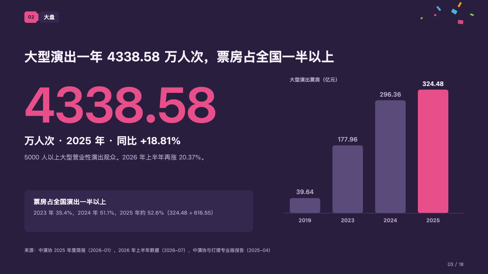
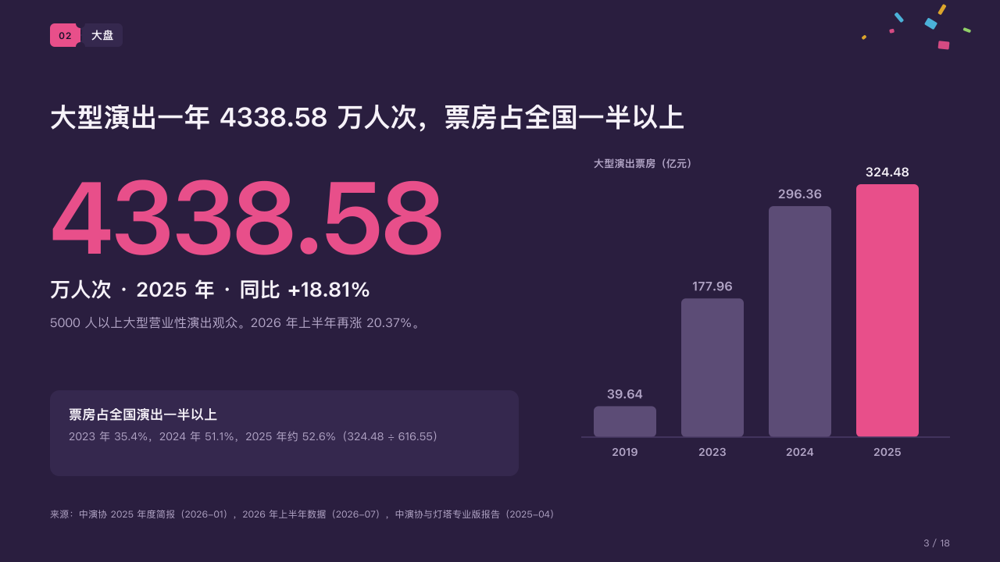

# crest

One figure at its crest, and the run of years that led to it.

Code: [`src/layouts/compositions/crest.tsx`](../../../src/layouts/compositions/crest.tsx). The header comment there is the contract. The marquee setting only.

## rally, summer concert season proposal sample, 2026-10

Settled on the market page (p03). The round's decisions are in [rounds/2026-10-06-rally](../../rounds/2026-10-06-rally/README.md).

| board (p03) | engine |
| :-: | :-: |
|  |  |

**What it looks like.** At the left the figure at 130px bold in the magenta, its characters drawn 3px together (「4338.58」); under it its unit and label on one bold line at 26px (「万人次 · 2025 年 · 同比 +18.81%」) and its note at 16/26 in the grey; at the foot of the column a card with a bold line and the figures it rests on. At the right an upright bar a year, 80px wide and 112px apart over a hairline, the marked bar in the magenta and the rest in the dim violet, each value over its bar and each year under it, the series named over them with its unit (「大型演出票房（亿元）」).

**Why.** A market page has one number the room should remember. Setting it huge beside the bars that climbed to it says both how big and how fast, and the card says what share of the whole it is.

**What it gave up.**

- A `kpi_cards` of one item with no delta, tone, icon, source or tag, then a `bar` chart of one upright series of two to six bars with at most one marked and no tag, bands, changes or reference, then optionally a `callout` with a title and no icon or tag.
- The figure wider than its column at 130px, the unit line past one line, the note past two lines, a value wider than its bar or a year wider than its slot sends the page back.
